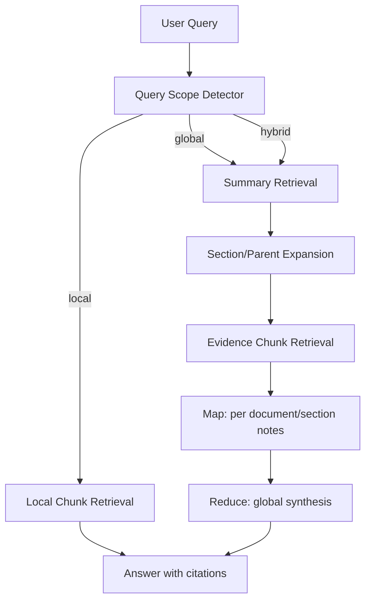

# RAGFlow-Inspired Retrieval Optimization Implementation Plan

> **For agentic workers:** REQUIRED SUB-SKILL: Use superpowers:executing-plans to implement this plan task-by-task. Steps use checkbox (`- [ ]`) syntax for tracking.

**Goal:** 在不破坏 Recall 现有 RAG Runtime、SSE/SEE、Rerank request_id 撤销、recommendations 与 `cot_plan` 摘要输出的前提下，吸收 RAGFlow 的检索设计，把 Recall 的检索精准度、候选治理和端到端速度提升为可评测、可灰度、可回滚的第二套检索策略。

**Architecture:** RAGFlow 的核心不是单纯向量搜索，而是“索引阶段富字段 + 查询阶段字段加权表达式 + 混合召回/融合 + 候选集治理 + 父子 chunk/TOC/KG 增强”。Recall 当前已经有 Milvus 向量、Elasticsearch BM25、LightRAG-lite 图检索、RRF、Rerank、Query Optimize、SEE trace，因此本计划采用旁路增强：新增 RAGFlow-inspired 查询构造、字段权重、加权混合打分、候选 cap 与 trace，而不是替换现有 RRF 主路径。

**Tech Stack:** Python 3.11, FastAPI, Pydantic, pytest, Elasticsearch, Milvus, DashScope Embedding/Rerank/LLM, asyncio, cachetools, optional SQLite state, existing Recall services.

---

## 0. RAGFlow 检索核心分析

### 0.1 RAGFlow 是干什么的

RAGFlow 是一个以“深度文档理解”为中心的 RAG 引擎。它把 PDF、Word、图片、表格、QA、网页、邮件等内容通过 parser worker 解析成结构化 chunk，再写入 DocStore；查询时同时使用全文检索、向量检索、rerank、知识图谱、TOC、父子 chunk 和引用修复，服务于 Dataset Search、Chat、Search App 与 Agent tool。

核心代码位置：

- `/Users/lvdaxianer/workspace/my/project/ragflow/rag/svr/task_executor.py`
  - ingestion worker、解析、关键词/问题/tag 生成、embedding、bulk insert。
- `/Users/lvdaxianer/workspace/my/project/ragflow/rag/nlp/query.py`
  - 全文查询表达式、字段权重、中文/英文 tokenization、同义词、近邻短语。
- `/Users/lvdaxianer/workspace/my/project/ragflow/rag/nlp/search.py`
  - hybrid search、vector match、FusionExpr、rerank、KNN score 二次获取、父子 chunk 替换、citation。
- `/Users/lvdaxianer/workspace/my/project/ragflow/api/apps/services/dataset_api_service.py`
  - dataset search API：metadata filter、cross_languages、keyword extraction、rerank、KG、children retrieval。
- `/Users/lvdaxianer/workspace/my/project/ragflow/agent/tools/retrieval.py`
  - 把 RAG 检索包装成 Agent tool。

### 0.2 RAGFlow 如何提升精准度

RAGFlow 的精准度来自多层信号叠加：

1. **索引富字段**
   - `title_tks`
   - `title_sm_tks`
   - `important_kwd`
   - `important_tks`
   - `question_tks`
   - `content_ltks`
   - `content_sm_ltks`
   - `content_with_weight`
   - `mom_id`
   - `TAG_FLD`
   - `PAGERANK_FLD`

2. **字段权重强区分**
   - `important_kwd^30`
   - `important_tks^20`
   - `question_tks^20`
   - `title_tks^10`
   - `title_sm_tks^5`
   - `content_ltks^2`
   - `content_sm_ltks`

3. **查询归一化**
   - 传统转简体。
   - 全角转半角。
   - 小写化。
   - 清理 DocStore/Infinity/ES query parser 容易误解的特殊字符。
   - 中文英文之间加空格，避免 token 粘连。

4. **中文查询增强**
   - term weight。
   - fine-grained tokenization。
   - 同义词扩展。
   - 邻近短语 `"... "~2` boost。
   - `minimum_should_match` 防止泛化过度。

5. **英文查询增强**
   - token weight。
   - WordNet/同义词扩展。
   - 相邻词 phrase boost。

6. **混合召回与重排**
   - DocStore 层用 `MatchTextExpr + MatchDenseExpr + FusionExpr("weighted_sum")`。
   - 运行时再按 `term_similarity_weight = 1 - vector_similarity_weight` 与 `vector_similarity_weight` 融合。
   - 外部 rerank 模型启用时，对候选文本进行二次语义重排。

7. **上下文增强**
   - `label_question()` 产生 rank feature。
   - `retrieval_by_children()` 用 parent/mother chunk 替换 child chunk，回答时上下文更完整。
   - 可选 TOC enhance、KG retrieval、cross_languages、keyword extraction。

8. **引用修复**
   - `insert_citations()` 计算 answer 与 chunk 的 token/vector 相似度，减少引用错位。

### 0.3 RAGFlow 如何提升速度

RAGFlow 的速度优化不是只靠快模型，而是减少无效工作：

1. **API 与 worker 分离**
   - API 处理请求。
   - worker 从 Redis/Valkey 队列消费解析任务。

2. **批处理**
   - embedding 按 `settings.EMBEDDING_BATCH_SIZE` 批量编码。
   - DocStore bulk insert 写入 chunk。

3. **LLM 缓存**
   - auto keywords、auto questions、content tags 使用 cache，避免重复调用 LLM。

4. **并发但有限流**
   - chunk、embedding、MinIO、KG 等阶段分别有限流器。

5. **rerank 候选 cap**
   - 外部 reranker 启用时 provider-safe 上限为 64。
   - 小 page size 时仍保证最小窗口。

6. **避免搬运向量**
   - ES 路径主检索不返回 chunk vectors。
   - 需要干净 cosine 分时再做 KNN-only 二次调用。
   - citation 需要向量时才 hydrate。

7. **失败降级**
   - 零结果时降低 `min_match` 和 vector similarity。
   - 文档过滤存在时可退回 filter-only 搜索。

### 0.4 Recall 当前能力对比

Recall 已有能力：

- `app/services/rag_search_pipeline_service.py`
  - 并行 ES BM25、LightRAG-lite graph、Milvus vector。
  - RRF 融合。
  - retrieval_context prerank。
  - Rerank candidate limit。
  - confident leader skip rerank。
  - feature boost。
  - domain rule rerank。
  - profile/SEE trace 数据基础。

- `app/services/es_service.py`
  - `description` / `description_en` multi_match。
  - metadata filter。
  - IK analyzer 创建与 standard fallback。

- `app/services/query_optimize_service.py`
  - fast rules。
  - LLM optimize。
  - `cot_plan` 摘要。
  - `expanded_queries`。
  - normalized cache。

- `app/services/feature_boost_service.py`
  - tags/category 特征 boost。

主要差距：

- ES 文档结构还没有 RAGFlow 那种 `title/important/question/content` 富字段。
- BM25 查询还没有字段权重表达式、同义词、邻近短语与 min_should_match 策略。
- RRF 是主融合策略，缺少可灰度的 `term/vector/graph` 加权 hybrid score 旁路。
- score trace 还没有精确暴露每个候选的 BM25/vector/graph/rerank/feature 分数来源。
- rerank cap 已有，但默认 6，缺少按 provider-safe 64 与 topK/page 组合的策略说明。
- ES 主路径暂不涉及向量搬运，但也没有 KNN-only score 校准能力。
- 父子 chunk、TOC、KG 增强在 Recall 当前资产/技能场景中还不是完整数据模型，需要先作为兼容字段与可选增强。
- 当前 chunk 检索更适合局部问题；面对“整体架构是什么”“这批文档共同问题是什么”“项目能力缺口有哪些”这类全局问题时，单个 chunk 会丢失跨章节、跨文档上下文，需要 summary hierarchy、parent expansion 和 map-reduce synthesis。

### 0.5 Chunk 分块后的上下文丢失问题

分块检索的根本矛盾是：小 chunk 便于精准召回，但不具备全局语义；大 chunk 保留上下文，但会降低召回精度并增加 rerank/LLM 成本。因此不能只调 chunk size，而要引入分层检索。

需要把查询分成三类：

- `local`
  - 局部事实、故障、配置、接口、代码片段、某个功能点。
  - 走现有 chunk 检索、字段加权 BM25、Milvus、Graph、Rerank。

- `global`
  - 整体总结、架构概览、跨文档共性、全库能力盘点、趋势/缺口分析。
  - 先检索 document/section summary，再展开证据 chunk，最后 map-reduce 汇总。

- `hybrid`
  - 先全局定位范围，再局部取证。
  - 示例：“Recall 当前 RAG 能力还缺什么，以及哪些文件能证明？”

推荐架构：



RAGFlow 对这个方向的启发：

- `mom_id` / `retrieval_by_children()`：命中子 chunk 后补母 chunk，减少局部片段割裂。
- TOC enhance：用目录/章节结构帮助定位全局上下文。
- RAPTOR：构建多层摘要树，支持自顶向下检索。
- GraphRAG：用实体/关系/社区摘要解决跨文档全局问题。
- auto questions / keywords / tags：让 summary 与 chunk 都有更稳定的检索入口。

---

## 1. 执行原则

- [x] 每个任务先写失败测试，再写最小实现，再运行目标测试。
- [x] 不回滚已有未提交改动。
- [x] 不修改 `/Users/lvdaxianer/workspace/my/project/ragflow`，RAGFlow 只作为研究参考。
- [x] 不破坏 `/api/v1/rag/{id}/search/optimize` 返回结构。
- [x] 不破坏 Rerank `request_id` 撤销。
- [x] 不输出完整私有 CoT，只输出 `cot_plan` 检索计划摘要。
- [x] 新策略默认关闭或保守启用，先通过配置灰度。
- [x] 每个阶段完成后运行对应测试和 `git diff --check`。
- [x] 评测必须同时记录精准度和速度，不只看单条样例。

---

## 2. 文件责任地图

### 2.1 新增文件

- `app/services/ragflow_query_builder.py`
  - 构造 RAGFlow-inspired ES query body。
  - 负责 query normalization、字段权重、同义词扩展、邻近短语、minimum_should_match。
  - 不直接调用 ES。

- `app/services/ragflow_hybrid_score.py`
  - 基于 ES/vector/graph/rerank/feature 原始分数生成 weighted hybrid score。
  - 记录 per-channel score trace。
  - 不做网络调用。

- `app/services/retrieval_trace_service.py`
  - 统一构造候选级 score trace 和 SEE stage 摘要。
  - 保持 `cot_plan` 只输出摘要，不输出内部推理链。

- `app/services/query_scope_service.py`
  - 判断查询是 `local`、`global` 还是 `hybrid`。
  - 输出稳定、可测试的 scope、reason、route_plan。
  - 不调用检索服务。

- `app/services/summary_index_service.py`
  - 构造 document summary、section summary 的索引 payload。
  - 第一阶段先支持从 metadata/features 或外部传入 summary，不强制调用 LLM。
  - 后续可接 LLM summary 生成与缓存。

- `app/services/global_retrieval_service.py`
  - 编排 summary retrieval、section expansion、evidence chunk retrieval、map-reduce synthesis 的数据流。
  - 第一阶段只返回 structured context，不直接生成最终自然语言答案。

- `tests/test_ragflow_query_builder.py`
  - 覆盖归一化、字段权重、特殊字符清理、中文短语邻近、英文同义词开关。

- `tests/test_ragflow_hybrid_score.py`
  - 覆盖 weighted score、缺失通道、trace、与 RRF 并存。

- `tests/test_retrieval_trace_service.py`
  - 覆盖 score trace 不泄露敏感内容、不输出完整 CoT。

- `tests/test_query_scope_service.py`
  - 覆盖局部、全局、混合问题识别。

- `tests/test_summary_index_service.py`
  - 覆盖 summary payload、parent/section 字段、旧文档兼容。

- `tests/test_global_retrieval_service.py`
  - 覆盖 summary-first 检索、section expansion、map-reduce context 结构。

### 2.2 修改文件

- `app/config.py`
  - 增加 RAGFlow-inspired 策略配置。

- `.env.example`
  - 增加对应环境变量。

- `app/models/schemas.py`
  - 给 `SearchRequest` 增加可选策略字段时必须向后兼容。
  - 给 `SearchResult` 增加可选 score trace 时必须默认 `None`。

- `app/services/es_index_config.py`
  - 扩展 ES mapping，支持 `title_tks`、`important_kwd`、`question_tks`、`content_ltks` 等兼容字段。

- `app/services/es_service.py`
  - 写入富字段。
  - 支持 `search_weighted()` 或 `search(..., strategy="ragflow_weighted")`。
  - 保留现有 `search()` 行为。

- `app/services/feature_extract_service.py`
  - 将已有 features/tags/category 转换为 `important_kwd`、`question_tks` 等字段来源。

- `app/services/rag_search_pipeline_service.py`
  - 新增策略开关，保持默认 RRF。
  - 旁路调用 weighted hybrid scoring。
  - profile 中记录策略、weights、候选 cap 与 trace。

- `app/services/rerank_service.py`
  - 保持 `request_id` lineage。
  - 增加 provider-safe candidate cap 辅助函数。

- `app/routers/rag_stream.py`
  - SSE 中输出 strategy/score trace 摘要。

- `app/routers/rag_optimize.py`
  - `see_trace` 增加 RAGFlow-inspired 策略摘要，不改变字段名。

- `app/services/query_optimize_service.py`
  - 在 `cot_plan` 摘要中加入 query scope 与全局/局部路由计划。
  - 不输出完整私有 CoT。

- `app/services/embedding_service.py`
  - 后续可用于 document/section summary embedding。
  - 必须复用现有缓存与限流策略。

- `app/services/milvus_service.py`
  - 后续可写入 summary collection 或用 metadata 标记 summary/chunk 层级。
  - 不能影响现有 skill/asset collection 查询。

- `tests/test_es_service.py`
  - 覆盖富字段 index body 和 weighted query body。

- `tests/test_rag_search_pipeline_service.py`
  - 覆盖策略开关、weighted hybrid、rerank cap、profile。

- `tests/test_rag_stream_router.py`
  - 覆盖 SSE strategy/trace 事件。

- `tests/test_query_optimize_service.py`
  - 覆盖 `cot_plan` 仍为摘要。

---

## 3. 阶段 0：基线保护与研究证据固化

### Task 0.1: 固定 Recall 当前基线

**Files:**
- Read only: `docs/superpowers/plans/2026-06-02-rag-agent-runtime-roadmap.md`
- Read only: `docs/superpowers/plans/2026-06-03-rag-agent-runtime-remaining-work-plan.md`

- [x] **Step 1: 查看工作树**

Run:

```bash
git status --short
```

Expected:

```text
输出已有未提交改动；记录但不回滚。
```

- [x] **Step 2: 运行 RAG 核心回归**

Run:

```bash
.venv/bin/pytest tests/test_es_service.py tests/test_rag_search_pipeline_service.py tests/test_query_optimize_service.py tests/test_rag_stream_router.py tests/test_rerank_service.py -q
```

Expected:

```text
全部通过；若外部依赖未启动，mock 单测应通过，真实集成测试按现有 skip 规则跳过。
```

- [x] **Step 3: 运行 diff 检查**

Run:

```bash
git diff --check
```

Expected:

```text
无 trailing whitespace、conflict marker。
```

### Task 0.2: 增加 RAGFlow 检索研究文档引用

**Files:**
- Modify: `docs/superpowers/plans/2026-06-02-rag-agent-runtime-roadmap.md`
- Modify: `docs/superpowers/plans/2026-06-03-rag-agent-runtime-remaining-work-plan.md`

- [x] **Step 1: 在 roadmap 顶部加入关联计划链接**

Add below existing remaining-work link:

```markdown
> RAGFlow 检索精准度与速度优化迁移计划见：`docs/superpowers/plans/2026-06-03-ragflow-retrieval-optimization-study-and-migration-plan.md`
```

- [x] **Step 2: 在 remaining-work 计划的执行总原则前加入关联计划**

Add:

```markdown
## 关联计划

- RAGFlow 检索精准度与速度优化迁移计划：`docs/superpowers/plans/2026-06-03-ragflow-retrieval-optimization-study-and-migration-plan.md`
```

- [x] **Step 3: 验证链接**

Run:

```bash
test -f docs/superpowers/plans/2026-06-03-ragflow-retrieval-optimization-study-and-migration-plan.md
rg -n "ragflow-retrieval-optimization-study-and-migration-plan" docs/superpowers/plans/2026-06-02-rag-agent-runtime-roadmap.md docs/superpowers/plans/2026-06-03-rag-agent-runtime-remaining-work-plan.md
```

Expected:

```text
两个计划文件都能搜到新计划链接。
```

---

## 4. 阶段 A：配置开关与兼容模型

### Task A1: 增加 RAGFlow-inspired 策略配置

**Files:**
- Modify: `app/config.py`
- Modify: `.env.example`
- Test: `tests/test_config.py`
- Test: `tests/test_env_example.py`

- [x] **Step 1: 写失败测试**

Add to `tests/test_config.py`:

```python
def test_ragflow_inspired_retrieval_defaults_are_safe():
    from app.config import Config

    assert Config.RAG_RETRIEVAL_STRATEGY in {"rrf", "ragflow_weighted"}
    assert Config.RAG_RETRIEVAL_STRATEGY == "rrf"
    assert 0.0 <= Config.RAG_WEIGHTED_VECTOR_WEIGHT <= 1.0
    assert 0.0 <= Config.RAG_WEIGHTED_TEXT_WEIGHT <= 1.0
    assert Config.RAG_RERANK_PROVIDER_SAFE_LIMIT == 64
```

Add to `tests/test_env_example.py`:

```python
def test_env_example_documents_ragflow_inspired_retrieval_settings():
    content = Path(".env.example").read_text(encoding="utf-8")

    assert "RAG_RETRIEVAL_STRATEGY=" in content
    assert "RAG_WEIGHTED_TEXT_WEIGHT=" in content
    assert "RAG_WEIGHTED_VECTOR_WEIGHT=" in content
    assert "RAG_WEIGHTED_GRAPH_WEIGHT=" in content
    assert "RAG_RERANK_PROVIDER_SAFE_LIMIT=" in content
```

- [x] **Step 2: 运行测试确认失败**

Run:

```bash
.venv/bin/pytest tests/test_config.py::test_ragflow_inspired_retrieval_defaults_are_safe tests/test_env_example.py::test_env_example_documents_ragflow_inspired_retrieval_settings -q
```

Expected:

```text
FAIL，提示配置字段不存在或 .env.example 未记录。
```

- [x] **Step 3: 实现最小配置**

Add to `app/config.py`:

```python
RAG_RETRIEVAL_STRATEGY: str = os.getenv("RAG_RETRIEVAL_STRATEGY", "rrf")
RAG_WEIGHTED_TEXT_WEIGHT: float = float(os.getenv("RAG_WEIGHTED_TEXT_WEIGHT", "0.35"))
RAG_WEIGHTED_VECTOR_WEIGHT: float = float(os.getenv("RAG_WEIGHTED_VECTOR_WEIGHT", "0.55"))
RAG_WEIGHTED_GRAPH_WEIGHT: float = float(os.getenv("RAG_WEIGHTED_GRAPH_WEIGHT", "0.10"))
RAG_RERANK_PROVIDER_SAFE_LIMIT: int = int(os.getenv("RAG_RERANK_PROVIDER_SAFE_LIMIT", "64"))
RAG_WEIGHTED_QUERY_MIN_SHOULD_MATCH: str = os.getenv("RAG_WEIGHTED_QUERY_MIN_SHOULD_MATCH", "60%")
```

Add to `.env.example`:

```bash
RAG_RETRIEVAL_STRATEGY=rrf
RAG_WEIGHTED_TEXT_WEIGHT=0.35
RAG_WEIGHTED_VECTOR_WEIGHT=0.55
RAG_WEIGHTED_GRAPH_WEIGHT=0.10
RAG_RERANK_PROVIDER_SAFE_LIMIT=64
RAG_WEIGHTED_QUERY_MIN_SHOULD_MATCH=60%
```

- [x] **Step 4: 运行测试**

Run:

```bash
.venv/bin/pytest tests/test_config.py tests/test_env_example.py -q
```

Expected:

```text
全部通过。
```

### Task A2: SearchResult 兼容 score trace

**Files:**
- Modify: `app/models/schemas.py`
- Test: `tests/test_agent_schemas.py` or create `tests/test_search_result_trace_schema.py`

- [x] **Step 1: 写失败测试**

Create `tests/test_search_result_trace_schema.py`:

```python
from app.models.schemas import SearchResult


def test_search_result_accepts_optional_score_trace():
    result = SearchResult(
        metadata={"id": "doc-1", "type": "skill", "description": "小程序白屏排查"},
        description="小程序上线后白屏排查",
        score=0.91,
        score_trace={
            "strategy": "ragflow_weighted",
            "text_score": 0.8,
            "vector_score": 0.9,
            "graph_score": 0.2,
            "final_score": 0.91,
        },
    )

    assert result.score_trace["strategy"] == "ragflow_weighted"


def test_search_result_legacy_payload_still_valid():
    result = SearchResult(
        metadata={"id": "doc-1", "type": "skill", "description": "小程序白屏排查"},
        description="小程序上线后白屏排查",
        score=0.91,
    )

    assert result.score_trace is None
```

- [x] **Step 2: 运行测试确认失败**

Run:

```bash
.venv/bin/pytest tests/test_search_result_trace_schema.py -q
```

Expected:

```text
FAIL，提示 SearchResult 不接受 score_trace。
```

- [x] **Step 3: 最小实现**

Modify `app/models/schemas.py`:

```python
class SearchResult(BaseModel):
    """检索结果项"""
    metadata: dict = Field(..., description="原始 metadata 信息")
    description: str = Field(..., description="原始描述文本")
    score: float = Field(..., description="Rerank 分数")
    features: Optional[dict] = Field(None, description="特征标签，包含 category 和 tags")
    score_trace: Optional[dict] = Field(None, description="候选级检索分数追踪")
```

- [x] **Step 4: 运行 schema 回归**

Run:

```bash
.venv/bin/pytest tests/test_search_result_trace_schema.py tests/test_rag_router.py tests/test_rag_stream_router.py -q
```

Expected:

```text
全部通过，旧响应 payload 不需要传 score_trace。
```

---

## 5. 阶段 B：RAGFlow-style 查询归一化与字段加权构造器

### Task B1: 新增查询归一化函数

**Files:**
- Create: `app/services/ragflow_query_builder.py`
- Test: `tests/test_ragflow_query_builder.py`

- [x] **Step 1: 写失败测试**

Create `tests/test_ragflow_query_builder.py`:

```python
from app.services.ragflow_query_builder import normalize_weighted_query


def test_normalize_weighted_query_cleans_parser_sensitive_chars():
    assert normalize_weighted_query("小程序（上线后）白屏？？") == "小程序 上线后 白屏"


def test_normalize_weighted_query_lowercases_and_compacts_spaces():
    assert normalize_weighted_query("  MiniProgram   WHITE  Screen  ") == "miniprogram white screen"
```

- [x] **Step 2: 运行测试确认失败**

Run:

```bash
.venv/bin/pytest tests/test_ragflow_query_builder.py::test_normalize_weighted_query_cleans_parser_sensitive_chars tests/test_ragflow_query_builder.py::test_normalize_weighted_query_lowercases_and_compacts_spaces -q
```

Expected:

```text
FAIL，提示模块不存在。
```

- [x] **Step 3: 最小实现**

Create `app/services/ragflow_query_builder.py`:

```python
import re


_PARSER_SENSITIVE_RE = re.compile(r"[ :|\r\n\t,，。？?/`!！&^%()\[\]{}<>*~'\"\\]+")


def normalize_weighted_query(query: str) -> str:
    """清理检索后端 query parser 容易误解的字符。"""
    text = (query or "").lower()
    text = _PARSER_SENSITIVE_RE.sub(" ", text)
    return re.sub(r"\s+", " ", text).strip()
```

- [x] **Step 4: 运行测试**

Run:

```bash
.venv/bin/pytest tests/test_ragflow_query_builder.py -q
```

Expected:

```text
全部通过。
```

### Task B2: 构造 RAGFlow-inspired ES weighted query body

**Files:**
- Modify: `app/services/ragflow_query_builder.py`
- Test: `tests/test_ragflow_query_builder.py`

- [x] **Step 1: 写失败测试**

Add:

```python
from app.services.ragflow_query_builder import build_weighted_es_query


def test_build_weighted_es_query_uses_ragflow_field_boosts():
    body = build_weighted_es_query("小程序上线后白屏", top_k=20)
    should = body["query"]["bool"]["should"]
    multi_match = should[0]["multi_match"]

    assert body["size"] == 20
    assert "important_kwd^30" in multi_match["fields"]
    assert "important_tks^20" in multi_match["fields"]
    assert "question_tks^20" in multi_match["fields"]
    assert "title_tks^10" in multi_match["fields"]
    assert "content_ltks^2" in multi_match["fields"]
    assert multi_match["minimum_should_match"] == "60%"


def test_build_weighted_es_query_preserves_metadata_filter():
    body = build_weighted_es_query(
        "小程序白屏",
        top_k=5,
        metadata_filter={"type": "skill"},
    )

    filters = body["query"]["bool"]["filter"]
    assert {"term": {"metadata.type.keyword": "skill"}} in filters
```

- [x] **Step 2: 运行测试确认失败**

Run:

```bash
.venv/bin/pytest tests/test_ragflow_query_builder.py::test_build_weighted_es_query_uses_ragflow_field_boosts tests/test_ragflow_query_builder.py::test_build_weighted_es_query_preserves_metadata_filter -q
```

Expected:

```text
FAIL，提示 build_weighted_es_query 不存在。
```

- [x] **Step 3: 实现最小 query builder**

Add:

```python
from typing import Any, Dict, Optional

from app.config import Config


RAGFLOW_WEIGHTED_FIELDS = [
    "important_kwd^30",
    "important_tks^20",
    "question_tks^20",
    "title_tks^10",
    "title_sm_tks^5",
    "content_ltks^2",
    "content_sm_ltks",
    "description",
    "description_en",
]


def build_metadata_filters(metadata_filter: Optional[Dict[str, Any]]) -> list[Dict[str, Any]]:
    if not metadata_filter:
        return []
    return [
        {"term": {f"metadata.{key}.keyword": value}}
        for key, value in metadata_filter.items()
        if value is not None
    ]


def build_weighted_es_query(
    query: str,
    top_k: int,
    metadata_filter: Optional[Dict[str, Any]] = None,
) -> Dict[str, Any]:
    normalized_query = normalize_weighted_query(query)
    query_body: Dict[str, Any] = {
        "bool": {
            "should": [
                {
                    "multi_match": {
                        "query": normalized_query,
                        "fields": RAGFLOW_WEIGHTED_FIELDS,
                        "type": "best_fields",
                        "minimum_should_match": Config.RAG_WEIGHTED_QUERY_MIN_SHOULD_MATCH,
                    }
                }
            ],
            "minimum_should_match": 1,
        }
    }
    filters = build_metadata_filters(metadata_filter)
    if filters:
        query_body["bool"]["filter"] = filters
    return {"query": query_body, "size": top_k}
```

- [x] **Step 4: 运行测试**

Run:

```bash
.venv/bin/pytest tests/test_ragflow_query_builder.py -q
```

Expected:

```text
全部通过。
```

### Task B3: 增加邻近短语 boost

**Files:**
- Modify: `app/services/ragflow_query_builder.py`
- Test: `tests/test_ragflow_query_builder.py`

- [x] **Step 1: 写失败测试**

Add:

```python
def test_build_weighted_es_query_adds_phrase_proximity_boost():
    body = build_weighted_es_query("小程序 上线后 白屏", top_k=10)
    should = body["query"]["bool"]["should"]

    assert any("match_phrase" in clause for clause in should)
    phrase_clause = next(clause["match_phrase"] for clause in should if "match_phrase" in clause)
    assert phrase_clause["content_ltks"]["query"] == "小程序 上线后 白屏"
    assert phrase_clause["content_ltks"]["slop"] == 2
    assert phrase_clause["content_ltks"]["boost"] == 1.5
```

- [x] **Step 2: 运行测试确认失败**

Run:

```bash
.venv/bin/pytest tests/test_ragflow_query_builder.py::test_build_weighted_es_query_adds_phrase_proximity_boost -q
```

Expected:

```text
FAIL，当前 should 中没有 match_phrase。
```

- [x] **Step 3: 实现 phrase boost**

Inside `build_weighted_es_query()` after initial `should`:

```python
if len(normalized_query.split()) >= 2:
    query_body["bool"]["should"].append(
        {
            "match_phrase": {
                "content_ltks": {
                    "query": normalized_query,
                    "slop": 2,
                    "boost": 1.5,
                }
            }
        }
    )
```

- [x] **Step 4: 运行测试**

Run:

```bash
.venv/bin/pytest tests/test_ragflow_query_builder.py -q
```

Expected:

```text
全部通过。
```

---

## 6. 阶段 C：ES 富字段索引

### Task C1: ES document body 写入 RAGFlow-compatible 字段

**Files:**
- Modify: `app/services/es_service.py`
- Test: `tests/test_es_service.py`

- [x] **Step 1: 写失败测试**

Add to `tests/test_es_service.py`:

```python
def test_build_document_body_includes_ragflow_compatible_fields():
    service = ESService()
    body = service._build_document_body(
        doc_id="skill-white-screen",
        description="小程序上线后白屏 本地开发正常",
        metadata={"type": "skill", "id": "skill-white-screen", "description": "小程序白屏排查"},
        features={
            "category": "小程序故障",
            "tags": ["小程序", "白屏", "生产环境"],
            "questions": ["小程序上线后为什么白屏"],
            "title": "小程序白屏排查",
        },
    )

    assert body["title_tks"] == "小程序白屏排查"
    assert body["important_kwd"] == ["小程序故障", "小程序", "白屏", "生产环境"]
    assert body["important_tks"] == "小程序故障 小程序 白屏 生产环境"
    assert body["question_tks"] == "小程序上线后为什么白屏"
    assert body["content_ltks"] == "小程序上线后白屏 本地开发正常"
    assert body["content_sm_ltks"] == "小程序上线后白屏 本地开发正常"
```

- [x] **Step 2: 运行测试确认失败**

Run:

```bash
.venv/bin/pytest tests/test_es_service.py::test_build_document_body_includes_ragflow_compatible_fields -q
```

Expected:

```text
FAIL，缺少 title_tks/important_kwd/question_tks/content_ltks。
```

- [x] **Step 3: 实现字段构造**

Add helper methods in `ESService`:

```python
def _build_ragflow_compatible_fields(
    self,
    description: str,
    metadata: Dict[str, Any],
    features: Optional[Dict[str, Any]],
) -> Dict[str, Any]:
    features = features or {}
    tags = [str(tag) for tag in features.get("tags", []) if tag]
    category = str(features.get("category", "") or "")
    title = str(features.get("title") or metadata.get("description") or metadata.get("id") or "")
    questions = [str(question) for question in features.get("questions", []) if question]
    important = [value for value in [category, *tags] if value]
    return {
        "title_tks": title,
        "title_sm_tks": title,
        "important_kwd": important,
        "important_tks": " ".join(important),
        "question_tks": " ".join(questions),
        "content_ltks": description,
        "content_sm_ltks": description,
    }
```

Call from `_build_document_body()`:

```python
doc_body.update(self._build_ragflow_compatible_fields(description, metadata, features))
```

- [x] **Step 4: 运行 ES 单测**

Run:

```bash
.venv/bin/pytest tests/test_es_service.py -q
```

Expected:

```text
全部通过。
```

### Task C2: ES mapping 支持富字段

**Files:**
- Modify: `app/services/es_index_config.py`
- Test: `tests/test_es_service.py`

- [x] **Step 1: 写失败测试**

Add:

```python
from app.services.es_index_config import build_index_body_with_ik, build_index_body_without_ik


def test_es_index_mapping_contains_ragflow_compatible_fields():
    for body in [build_index_body_with_ik(), build_index_body_without_ik()]:
        props = body["mappings"]["properties"]
        assert "title_tks" in props
        assert "important_kwd" in props
        assert "important_tks" in props
        assert "question_tks" in props
        assert "content_ltks" in props
        assert "content_sm_ltks" in props
```

- [x] **Step 2: 运行测试确认失败**

Run:

```bash
.venv/bin/pytest tests/test_es_service.py::test_es_index_mapping_contains_ragflow_compatible_fields -q
```

Expected:

```text
FAIL，mapping 未声明富字段。
```

- [x] **Step 3: 实现 mapping**

Add text fields to both IK and standard mappings:

```python
"title_tks": {"type": "text", "analyzer": analyzer_name},
"title_sm_tks": {"type": "text", "analyzer": analyzer_name},
"important_kwd": {"type": "keyword"},
"important_tks": {"type": "text", "analyzer": analyzer_name},
"question_tks": {"type": "text", "analyzer": analyzer_name},
"content_ltks": {"type": "text", "analyzer": analyzer_name},
"content_sm_ltks": {"type": "text", "analyzer": analyzer_name},
```

For `build_index_body_without_ik()`, use `"standard"` analyzer or omit analyzer according to current file style.

- [x] **Step 4: 运行测试**

Run:

```bash
.venv/bin/pytest tests/test_es_service.py -q
```

Expected:

```text
全部通过。
```

---

## 7. 阶段 D：ES weighted search 旁路

### Task D1: ESService 增加 weighted search，不改变 search 默认行为

**Files:**
- Modify: `app/services/es_service.py`
- Test: `tests/test_es_service.py`

- [x] **Step 1: 写失败测试**

Add:

```python
@pytest.mark.asyncio
async def test_search_weighted_uses_ragflow_query_builder(monkeypatch):
    service = ESService()
    captured = {}

    class FakeClient:
        def search(self, index, body):
            captured["index"] = index
            captured["body"] = body
            return {
                "hits": {
                    "hits": [
                        {
                            "_id": "skill-white-screen",
                            "_score": 12.3,
                            "_source": {
                                "description": "小程序上线后白屏",
                                "metadata": {"type": "skill", "id": "skill-white-screen"},
                                "features": {"tags": ["小程序"]},
                            },
                        }
                    ]
                }
            }

        def ping(self):
            return True

    service.client = FakeClient()
    service._connected = True

    results = await service.search_weighted(
        index_name="rag_skills",
        query="小程序（上线后）白屏",
        top_k=5,
        metadata_filter={"type": "skill"},
    )

    assert captured["index"] == "rag_skills"
    assert captured["body"]["size"] == 5
    assert captured["body"]["query"]["bool"]["should"][0]["multi_match"]["query"] == "小程序 上线后 白屏"
    assert results[0]["score"] == 12.3
    assert results[0]["source_scores"]["text"] == 12.3
```

- [x] **Step 2: 运行测试确认失败**

Run:

```bash
.venv/bin/pytest tests/test_es_service.py::test_search_weighted_uses_ragflow_query_builder -q
```

Expected:

```text
FAIL，提示 search_weighted 不存在。
```

- [x] **Step 3: 实现 search_weighted**

Add import:

```python
from app.services.ragflow_query_builder import build_weighted_es_query
```

Add method:

```python
async def search_weighted(
    self,
    index_name: str,
    query: str,
    top_k: int,
    metadata_filter: Optional[Dict[str, Any]] = None,
) -> List[Dict[str, Any]]:
    body = build_weighted_es_query(query, top_k, metadata_filter)
    self._ensure_compatible_client()
    result = self.client.search(index=index_name, body=body)
    hits = result.get("hits", {}).get("hits", [])
    return [
        {
            "id": hit["_id"],
            "score": hit["_score"],
            "description": hit["_source"].get("description") or hit["_source"].get("description_en", ""),
            "metadata": hit["_source"].get("metadata", {}),
            "features": hit["_source"].get("features", {}),
            "source_scores": {"text": hit["_score"]},
        }
        for hit in hits
    ]
```

- [x] **Step 4: 运行测试**

Run:

```bash
.venv/bin/pytest tests/test_es_service.py tests/test_ragflow_query_builder.py -q
```

Expected:

```text
全部通过。
```

### Task D2: 检索管线支持 weighted ES 通道灰度

**Files:**
- Modify: `app/services/rag_search_pipeline_service.py`
- Test: `tests/test_rag_search_pipeline_service.py`

- [x] **Step 1: 写失败测试**

Add:

```python
@pytest.mark.asyncio
async def test_pipeline_uses_weighted_es_when_strategy_enabled(monkeypatch):
    import app.services.rag_search_pipeline_service as pipeline

    monkeypatch.setattr(pipeline.Config, "RAG_RETRIEVAL_STRATEGY", "ragflow_weighted")
    monkeypatch.setattr(pipeline, "_generate_query_vector", AsyncMock(return_value=[0.1, 0.2]))
    monkeypatch.setattr(pipeline, "_execute_vector_search", AsyncMock(return_value=[]))
    monkeypatch.setattr(pipeline, "_execute_graph_search", AsyncMock(return_value=[]))
    weighted = AsyncMock(return_value=[
        {
            "id": "skill-white-screen",
            "description": "小程序上线后白屏",
            "metadata": {"type": "skill", "id": "skill-white-screen"},
            "score": 12.3,
            "source_scores": {"text": 12.3},
        }
    ])
    monkeypatch.setattr(pipeline, "_execute_es_weighted_search", weighted)
    monkeypatch.setattr(pipeline, "_rerank_results", AsyncMock(side_effect=lambda query, results, request_id=None: results))

    result = await pipeline.run_search_pipeline_with_profile(
        "u001",
        SearchRequest(input="小程序上线后白屏", type="skill", topK=5),
    )

    assert weighted.await_count == 1
    assert result.profile["retrieval_strategy"]["strategy"] == "ragflow_weighted"
```

- [x] **Step 2: 运行测试确认失败**

Run:

```bash
.venv/bin/pytest tests/test_rag_search_pipeline_service.py::test_pipeline_uses_weighted_es_when_strategy_enabled -q
```

Expected:

```text
FAIL，提示 _execute_es_weighted_search 或策略 profile 不存在。
```

- [x] **Step 3: 实现 ES weighted executor**

Add:

```python
async def _execute_es_weighted_search(
    es_indexes: List[str],
    query_text: str,
    top_k: int,
    metadata_filter: Optional[Dict[str, Any]] = None,
) -> List[Dict[str, Any]]:
    try:
        es_service = get_es_service()
        search_tasks = [
            es_service.search_weighted(
                index_name=es_index,
                query=query_text,
                top_k=top_k,
                metadata_filter=metadata_filter,
            )
            for es_index in es_indexes
        ]
        result_lists = await asyncio.gather(*search_tasks)
        merged_results = []
        seen_ids = set()
        for results in result_lists:
            for result in results:
                doc_id = result.get("id")
                if doc_id and doc_id not in seen_ids:
                    seen_ids.add(doc_id)
                    merged_results.append(result)
        return merged_results
    except Exception as e:
        rag_search_logger.warning("[RAG检索] ES weighted 搜索失败: {}", str(e))
        _mark_fallback("es", str(e))
        return []
```

Modify ES task selection:

```python
if Config.RAG_RETRIEVAL_STRATEGY == "ragflow_weighted":
    es_func = _execute_es_weighted_search
else:
    es_func = _execute_es_bm25_search
es_search_task = asyncio.create_task(
    _timed("es_bm25", timings, es_func, es_indexes, request.input, vector_top_k, es_metadata_filter)
)
```

Update `_build_retrieval_strategy_profile()` to include:

```python
"strategy": Config.RAG_RETRIEVAL_STRATEGY,
```

- [x] **Step 4: 运行测试**

Run:

```bash
.venv/bin/pytest tests/test_rag_search_pipeline_service.py tests/test_es_service.py -q
```

Expected:

```text
全部通过。
```

---

## 8. 阶段 E：Weighted hybrid score 与 score trace

### Task E1: 新增 weighted hybrid score

**Files:**
- Create: `app/services/ragflow_hybrid_score.py`
- Test: `tests/test_ragflow_hybrid_score.py`

- [x] **Step 1: 写失败测试**

Create `tests/test_ragflow_hybrid_score.py`:

```python
from app.services.ragflow_hybrid_score import weighted_hybrid_fusion


def test_weighted_hybrid_fusion_combines_text_vector_graph_scores():
    vector = [{"id": "doc-1", "score": 0.9, "description": "A", "metadata": {"id": "doc-1"}}]
    text = [{"id": "doc-1", "score": 12.0, "description": "A", "metadata": {"id": "doc-1"}}]
    graph = [{"id": "doc-1", "score": 0.5, "description": "A", "metadata": {"id": "doc-1"}}]

    fused = weighted_hybrid_fusion(
        vector_results=vector,
        text_results=text,
        graph_results=graph,
        text_weight=0.35,
        vector_weight=0.55,
        graph_weight=0.10,
    )

    assert fused[0]["id"] == "doc-1"
    assert 0.0 <= fused[0]["score"] <= 1.0
    assert fused[0]["score_trace"]["text_score"] == 1.0
    assert fused[0]["score_trace"]["vector_score"] == 1.0
    assert fused[0]["score_trace"]["graph_score"] == 1.0
    assert fused[0]["score_trace"]["strategy"] == "ragflow_weighted"


def test_weighted_hybrid_fusion_keeps_docs_missing_one_channel():
    fused = weighted_hybrid_fusion(
        vector_results=[],
        text_results=[{"id": "doc-1", "score": 2.0, "description": "A", "metadata": {"id": "doc-1"}}],
        graph_results=[],
        text_weight=0.35,
        vector_weight=0.55,
        graph_weight=0.10,
    )

    assert fused[0]["id"] == "doc-1"
    assert fused[0]["score_trace"]["vector_score"] == 0.0
```

- [x] **Step 2: 运行测试确认失败**

Run:

```bash
.venv/bin/pytest tests/test_ragflow_hybrid_score.py -q
```

Expected:

```text
FAIL，模块不存在。
```

- [x] **Step 3: 实现最小 weighted fusion**

Create `app/services/ragflow_hybrid_score.py`:

```python
from typing import Any, Dict, List


def _normalize_by_id(results: List[Dict[str, Any]]) -> Dict[str, float]:
    if not results:
        return {}
    scores = [float(item.get("score", 0.0) or 0.0) for item in results]
    min_score = min(scores)
    max_score = max(scores)
    spread = max_score - min_score
    normalized = {}
    for item in results:
        doc_id = item.get("id") or item.get("doc_id")
        if not doc_id:
            continue
        score = float(item.get("score", 0.0) or 0.0)
        normalized[doc_id] = 1.0 if spread == 0 else (score - min_score) / spread
    return normalized


def weighted_hybrid_fusion(
    vector_results: List[Dict[str, Any]],
    text_results: List[Dict[str, Any]],
    graph_results: List[Dict[str, Any]],
    text_weight: float,
    vector_weight: float,
    graph_weight: float,
) -> List[Dict[str, Any]]:
    doc_map: Dict[str, Dict[str, Any]] = {}
    for source in [text_results, vector_results, graph_results]:
        for item in source:
            doc_id = item.get("id") or item.get("doc_id")
            if doc_id and doc_id not in doc_map:
                doc_map[doc_id] = item.copy()

    text_scores = _normalize_by_id(text_results)
    vector_scores = _normalize_by_id(vector_results)
    graph_scores = _normalize_by_id(graph_results)
    fused = []
    for doc_id, item in doc_map.items():
        text_score = text_scores.get(doc_id, 0.0)
        vector_score = vector_scores.get(doc_id, 0.0)
        graph_score = graph_scores.get(doc_id, 0.0)
        final_score = (
            text_score * text_weight
            + vector_score * vector_weight
            + graph_score * graph_weight
        )
        enriched = item.copy()
        enriched["score"] = round(final_score, 6)
        enriched["score_trace"] = {
            "strategy": "ragflow_weighted",
            "text_score": round(text_score, 6),
            "vector_score": round(vector_score, 6),
            "graph_score": round(graph_score, 6),
            "text_weight": text_weight,
            "vector_weight": vector_weight,
            "graph_weight": graph_weight,
            "final_score": round(final_score, 6),
        }
        fused.append(enriched)
    return sorted(fused, key=lambda item: item.get("score", 0.0), reverse=True)
```

- [x] **Step 4: 运行测试**

Run:

```bash
.venv/bin/pytest tests/test_ragflow_hybrid_score.py -q
```

Expected:

```text
全部通过。
```

### Task E2: 管线在策略开启时使用 weighted hybrid，默认仍 RRF

**Files:**
- Modify: `app/services/rag_search_pipeline_service.py`
- Test: `tests/test_rag_search_pipeline_service.py`
- Test: `tests/test_hybrid_search.py`

- [x] **Step 1: 写失败测试**

Add:

```python
@pytest.mark.asyncio
async def test_pipeline_weighted_strategy_returns_score_trace(monkeypatch):
    import app.services.rag_search_pipeline_service as pipeline

    monkeypatch.setattr(pipeline.Config, "RAG_RETRIEVAL_STRATEGY", "ragflow_weighted")
    monkeypatch.setattr(pipeline, "_generate_query_vector", AsyncMock(return_value=[0.1, 0.2]))
    monkeypatch.setattr(pipeline, "_execute_vector_search", AsyncMock(return_value=[
        {"id": "doc-1", "score": 0.9, "description": "小程序白屏", "metadata": {"id": "doc-1", "type": "skill"}}
    ]))
    monkeypatch.setattr(pipeline, "_execute_es_weighted_search", AsyncMock(return_value=[
        {"id": "doc-1", "score": 12.0, "description": "小程序白屏", "metadata": {"id": "doc-1", "type": "skill"}}
    ]))
    monkeypatch.setattr(pipeline, "_execute_graph_search", AsyncMock(return_value=[]))
    monkeypatch.setattr(pipeline, "_rerank_results", AsyncMock(side_effect=lambda query, results, request_id=None: results))

    result = await pipeline.run_search_pipeline_with_profile(
        "u001",
        SearchRequest(input="小程序白屏", type="skill", topK=5),
    )

    assert result.results[0].score_trace["strategy"] == "ragflow_weighted"
    assert result.profile["retrieval_strategy"]["strategy"] == "ragflow_weighted"
```

- [x] **Step 2: 运行测试确认失败**

Run:

```bash
.venv/bin/pytest tests/test_rag_search_pipeline_service.py::test_pipeline_weighted_strategy_returns_score_trace -q
```

Expected:

```text
FAIL，管线仍使用 RRF 或 SearchResult 未带 score_trace。
```

- [x] **Step 3: 实现 fusion 分支**

Import:

```python
from app.services.ragflow_hybrid_score import weighted_hybrid_fusion
```

Modify `_fuse_search_results()` signature:

```python
def _fuse_search_results(
    vector_results: List[Dict[str, Any]],
    es_results: List[Dict[str, Any]],
    graph_results: List[Dict[str, Any]],
    strategy: Optional[str] = None,
) -> List[Dict[str, Any]]:
```

Add branch:

```python
if strategy == "ragflow_weighted":
    return weighted_hybrid_fusion(
        vector_results=vector_results,
        text_results=es_results,
        graph_results=graph_results,
        text_weight=Config.RAG_WEIGHTED_TEXT_WEIGHT,
        vector_weight=Config.RAG_WEIGHTED_VECTOR_WEIGHT,
        graph_weight=Config.RAG_WEIGHTED_GRAPH_WEIGHT,
    )
```

Call with:

```python
fused_results = _fuse_search_results(
    vector_results,
    es_results,
    graph_results,
    strategy=Config.RAG_RETRIEVAL_STRATEGY,
)
```

Update `_build_search_results()` to pass through:

```python
score_trace=result.get("score_trace")
```

- [x] **Step 4: 运行 tests**

Run:

```bash
.venv/bin/pytest tests/test_rag_search_pipeline_service.py tests/test_ragflow_hybrid_score.py tests/test_hybrid_search.py -q
```

Expected:

```text
全部通过。
```

---

## 9. 阶段 F：Rerank 候选治理与速度保护

### Task F1: provider-safe rerank candidate cap

**Files:**
- Modify: `app/services/rag_search_pipeline_service.py`
- Test: `tests/test_rag_search_pipeline_service.py`

- [x] **Step 1: 写失败测试**

Add:

```python
def test_calculate_rerank_candidate_limit_caps_at_provider_safe_limit(monkeypatch):
    import app.services.rag_search_pipeline_service as pipeline

    monkeypatch.setattr(pipeline.Config, "RAG_RERANK_CANDIDATE_LIMIT", 200)
    monkeypatch.setattr(pipeline.Config, "RAG_RERANK_PROVIDER_SAFE_LIMIT", 64)

    assert pipeline._calculate_rerank_candidate_limit(total_candidates=120, top_k=100) == 64


def test_calculate_rerank_candidate_limit_respects_small_top_k(monkeypatch):
    import app.services.rag_search_pipeline_service as pipeline

    monkeypatch.setattr(pipeline.Config, "RAG_RERANK_CANDIDATE_LIMIT", 64)
    monkeypatch.setattr(pipeline.Config, "RAG_RERANK_PROVIDER_SAFE_LIMIT", 64)

    assert pipeline._calculate_rerank_candidate_limit(total_candidates=20, top_k=6) == 6
```

- [x] **Step 2: 运行测试确认失败**

Run:

```bash
.venv/bin/pytest tests/test_rag_search_pipeline_service.py::test_calculate_rerank_candidate_limit_caps_at_provider_safe_limit tests/test_rag_search_pipeline_service.py::test_calculate_rerank_candidate_limit_respects_small_top_k -q
```

Expected:

```text
FAIL，函数不存在。
```

- [x] **Step 3: 实现候选 cap**

Add:

```python
def _calculate_rerank_candidate_limit(total_candidates: int, top_k: Optional[int]) -> int:
    configured = max(1, Config.RAG_RERANK_CANDIDATE_LIMIT)
    provider_safe = max(1, Config.RAG_RERANK_PROVIDER_SAFE_LIMIT)
    requested = max(1, top_k or configured)
    return min(total_candidates, configured, provider_safe, requested)
```

Use in pipeline:

```python
rerank_count = _calculate_rerank_candidate_limit(len(fused_results), request.topK)
```

- [x] **Step 4: 运行测试**

Run:

```bash
.venv/bin/pytest tests/test_rag_search_pipeline_service.py::test_calculate_rerank_candidate_limit_caps_at_provider_safe_limit tests/test_rag_search_pipeline_service.py::test_rerank_results_limits_remote_candidates -q
```

Expected:

```text
全部通过。
```

### Task F2: profile 暴露候选 cap 决策

**Files:**
- Modify: `app/services/rag_search_pipeline_service.py`
- Test: `tests/test_rag_search_pipeline_service.py`

- [x] **Step 1: 写失败测试**

Add:

```python
@pytest.mark.asyncio
async def test_pipeline_profile_includes_rerank_cap_policy(monkeypatch):
    import app.services.rag_search_pipeline_service as pipeline

    monkeypatch.setattr(pipeline, "_generate_query_vector", AsyncMock(return_value=[0.1, 0.2]))
    monkeypatch.setattr(pipeline, "_execute_vector_search", AsyncMock(return_value=[]))
    monkeypatch.setattr(pipeline, "_execute_es_bm25_search", AsyncMock(return_value=[]))
    monkeypatch.setattr(pipeline, "_execute_graph_search", AsyncMock(return_value=[]))

    result = await pipeline.run_search_pipeline_with_profile(
        "u001",
        SearchRequest(input="无结果查询", type="skill", topK=5),
    )

    cap_policy = result.profile["rerank_decision"]["cap_policy"]
    assert "configured_limit" in cap_policy
    assert "provider_safe_limit" in cap_policy
```

- [x] **Step 2: 运行测试确认失败**

Run:

```bash
.venv/bin/pytest tests/test_rag_search_pipeline_service.py::test_pipeline_profile_includes_rerank_cap_policy -q
```

Expected:

```text
FAIL，rerank_decision 缺少 cap_policy。
```

- [x] **Step 3: 扩展 `_build_rerank_decision()`**

Ensure result includes:

```python
"cap_policy": {
    "configured_limit": Config.RAG_RERANK_CANDIDATE_LIMIT,
    "provider_safe_limit": Config.RAG_RERANK_PROVIDER_SAFE_LIMIT,
    "requested_top_k": request_top_k,
}
```

If current function does not accept `request_top_k`, modify signature and call sites explicitly.

- [x] **Step 4: 运行测试**

Run:

```bash
.venv/bin/pytest tests/test_rag_search_pipeline_service.py tests/test_rerank_service.py -q
```

Expected:

```text
全部通过，Rerank request_id 缓存撤销测试仍通过。
```

---

## 10. 阶段 G：Query Optimize 与 RAGFlow-style 查询扩展融合

### Task G1: `cot_plan` 增加检索策略摘要，不输出完整 CoT

**Files:**
- Modify: `app/services/query_optimize_service.py`
- Test: `tests/test_query_optimize_service.py`

- [x] **Step 1: 写失败测试**

Add:

```python
@pytest.mark.asyncio
async def test_optimize_cot_plan_mentions_weighted_retrieval_without_private_chain(monkeypatch):
    service = QueryOptimizeService(llm_service=None)
    result = await service.optimize("小程序上线后白屏，本地开发正常")

    joined = " ".join(result["cot_plan"])
    assert "字段加权" in joined or "关键实体" in joined
    assert "逐步推理" not in joined
    assert "chain of thought" not in joined.lower()
```

- [x] **Step 2: 运行测试确认失败或确认现状**

Run:

```bash
.venv/bin/pytest tests/test_query_optimize_service.py::test_optimize_cot_plan_mentions_weighted_retrieval_without_private_chain -q
```

Expected:

```text
PASS 或 FAIL；若 FAIL，仅补充摘要词，不加入完整推理过程。
```

- [x] **Step 3: 调整 fast rule 摘要**

For troubleshooting rule, ensure `cot_plan` includes:

```python
"使用字段加权检索标题、重要标签、问题表达和正文内容",
```

- [x] **Step 4: 运行测试**

Run:

```bash
.venv/bin/pytest tests/test_query_optimize_service.py tests/test_rag_stream_router.py -q
```

Expected:

```text
全部通过，SSE/SEE 输出仍只含 cot_plan 摘要。
```

### Task G2: expanded_queries 驱动 weighted ES 多查询召回

**Files:**
- Modify: `app/services/rag_search_pipeline_service.py`
- Modify: `app/routers/rag_optimize.py`
- Test: `tests/test_rag_search_pipeline_service.py`
- Test: `tests/test_rag_router.py`

- [x] **Step 1: 写失败测试**

Add pipeline-level test:

```python
@pytest.mark.asyncio
async def test_pipeline_accepts_expanded_queries_for_text_recall(monkeypatch):
    import app.services.rag_search_pipeline_service as pipeline

    seen_queries = []

    async def fake_weighted(indexes, query_text, top_k, metadata_filter=None):
        seen_queries.append(query_text)
        return []

    monkeypatch.setattr(pipeline.Config, "RAG_RETRIEVAL_STRATEGY", "ragflow_weighted")
    monkeypatch.setattr(pipeline, "_execute_es_weighted_search", fake_weighted)
    monkeypatch.setattr(pipeline, "_execute_vector_search", AsyncMock(return_value=[]))
    monkeypatch.setattr(pipeline, "_execute_graph_search", AsyncMock(return_value=[]))
    monkeypatch.setattr(pipeline, "_generate_query_vector", AsyncMock(return_value=[0.1, 0.2]))

    request = SearchRequest(input="主查询", type="skill", topK=5)
    request.expanded_queries = ["扩展查询一", "扩展查询二"]

    await pipeline.run_search_pipeline_with_profile("u001", request)

    assert seen_queries == ["主查询", "扩展查询一", "扩展查询二"]
```

- [x] **Step 2: 运行测试确认失败**

Run:

```bash
.venv/bin/pytest tests/test_rag_search_pipeline_service.py::test_pipeline_accepts_expanded_queries_for_text_recall -q
```

Expected:

```text
FAIL，SearchRequest 或管线不支持 expanded_queries。
```

- [x] **Step 3: 兼容增加 SearchRequest 字段**

Modify `SearchRequest`:

```python
expanded_queries: Optional[List[str]] = Field(default_factory=list, description="扩展检索查询列表")
```

Modify ES text recall helper to run primary + expanded queries and de-duplicate by id.

- [x] **Step 4: 在 optimize router 传递 expanded_queries**

When constructing optimized `SearchRequest`, set:

```python
expanded_queries=optimize_result.get("expanded_queries", [])[: Config.RAG_OPTIMIZE_QUERY_LIMIT]
```

- [x] **Step 5: 运行测试**

Run:

```bash
.venv/bin/pytest tests/test_rag_search_pipeline_service.py tests/test_rag_router.py tests/test_query_optimize_service.py -q
```

Expected:

```text
全部通过，原 `/search/optimize` 响应字段不变。
```

---

## 11. 阶段 H：metadata/tag/rank feature 精度增强

### Task H1: 从 features 生成 label-like rank feature

**Files:**
- Modify: `app/services/feature_boost_service.py`
- Test: `tests/test_feature_boost_service.py`

- [x] **Step 1: 写失败测试**

Add:

```python
def test_feature_boost_prefers_query_matching_tags():
    service = FeatureBoostService()
    results = [
        {"id": "doc-a", "score": 0.5, "features": {"tags": ["小程序", "白屏"]}},
        {"id": "doc-b", "score": 0.5, "features": {"tags": ["门禁", "梯控"]}},
    ]

    boosted = service.apply_local_tag_rank_feature("小程序上线后白屏", results)

    assert boosted[0]["id"] == "doc-a"
    assert boosted[0]["score"] > boosted[1]["score"]
    assert boosted[0]["score_trace"]["tag_rank_feature"] > 0
```

- [x] **Step 2: 运行测试确认失败**

Run:

```bash
.venv/bin/pytest tests/test_feature_boost_service.py::test_feature_boost_prefers_query_matching_tags -q
```

Expected:

```text
FAIL，方法不存在。
```

- [x] **Step 3: 实现本地 tag rank feature**

Add method:

```python
def apply_local_tag_rank_feature(self, query: str, results: List[Dict[str, Any]]) -> List[Dict[str, Any]]:
    query_text = query or ""
    boosted = []
    for result in results:
        tags = (result.get("features") or {}).get("tags", []) or []
        matches = [tag for tag in tags if str(tag) and str(tag) in query_text]
        item = result.copy()
        if matches:
            boost = min(0.03 * len(matches), 0.15)
            item["score"] = float(item.get("score", 0.0) or 0.0) + boost
            trace = dict(item.get("score_trace") or {})
            trace["tag_rank_feature"] = round(boost, 6)
            trace["tag_matches"] = matches
            item["score_trace"] = trace
        boosted.append(item)
    return sorted(boosted, key=lambda item: item.get("score", 0.0), reverse=True)
```

- [x] **Step 4: 运行测试**

Run:

```bash
.venv/bin/pytest tests/test_feature_boost_service.py -q
```

Expected:

```text
全部通过。
```

### Task H2: 管线在 weighted strategy 中应用 tag rank feature

**Files:**
- Modify: `app/services/rag_search_pipeline_service.py`
- Test: `tests/test_rag_search_pipeline_service.py`

- [x] **Step 1: 写失败测试**

Add:

```python
@pytest.mark.asyncio
async def test_weighted_pipeline_applies_tag_rank_feature(monkeypatch):
    import app.services.rag_search_pipeline_service as pipeline

    monkeypatch.setattr(pipeline.Config, "RAG_RETRIEVAL_STRATEGY", "ragflow_weighted")
    monkeypatch.setattr(pipeline, "_generate_query_vector", AsyncMock(return_value=[0.1, 0.2]))
    monkeypatch.setattr(pipeline, "_execute_vector_search", AsyncMock(return_value=[]))
    monkeypatch.setattr(pipeline, "_execute_graph_search", AsyncMock(return_value=[]))
    monkeypatch.setattr(pipeline, "_execute_es_weighted_search", AsyncMock(return_value=[
        {"id": "doc-a", "score": 1, "description": "小程序白屏", "metadata": {"id": "doc-a", "type": "skill"}, "features": {"tags": ["小程序"]}},
        {"id": "doc-b", "score": 1, "description": "门禁", "metadata": {"id": "doc-b", "type": "skill"}, "features": {"tags": ["门禁"]}},
    ]))
    monkeypatch.setattr(pipeline, "_rerank_results", AsyncMock(side_effect=lambda query, results, request_id=None: results))

    result = await pipeline.run_search_pipeline_with_profile(
        "u001",
        SearchRequest(input="小程序上线后白屏", type="skill", topK=2),
    )

    assert result.results[0].metadata["id"] == "doc-a"
    assert result.results[0].score_trace["tag_rank_feature"] > 0
```

- [x] **Step 2: 运行测试确认失败**

Run:

```bash
.venv/bin/pytest tests/test_rag_search_pipeline_service.py::test_weighted_pipeline_applies_tag_rank_feature -q
```

Expected:

```text
FAIL，tag rank feature 未进入 score_trace。
```

- [x] **Step 3: 实现管线调用**

After fusion and retrieval_context prerank:

```python
if Config.RAG_RETRIEVAL_STRATEGY == "ragflow_weighted":
    feature_boost_service = get_feature_boost_service()
    fused_results = feature_boost_service.apply_local_tag_rank_feature(request.input, fused_results)
```

- [x] **Step 4: 运行测试**

Run:

```bash
.venv/bin/pytest tests/test_rag_search_pipeline_service.py tests/test_feature_boost_service.py -q
```

Expected:

```text
全部通过。
```

---

## 12. 阶段 I：向量搬运与二次 score 校准

### Task I1: 明确 Milvus 输出字段，避免返回大向量

**Files:**
- Modify: `app/services/milvus_service.py`
- Test: `tests/test_milvus_service.py`

- [x] **Step 1: 写失败测试**

Add:

```python
def test_milvus_search_output_fields_do_not_include_embedding_vector():
    service = MilvusService()
    fields = service._build_search_output_fields()

    assert "embedding" not in fields
    assert "vector" not in fields
    assert "description" in fields
    assert "metadata" in fields
    assert "features" in fields
```

- [x] **Step 2: 运行测试确认失败或确认现状**

Run:

```bash
.venv/bin/pytest tests/test_milvus_service.py::test_milvus_search_output_fields_do_not_include_embedding_vector -q
```

Expected:

```text
PASS 或 FAIL；若 FAIL，说明当前 Milvus search 可能搬运了不必要的大向量。
```

- [x] **Step 3: 实现 output field helper**

Add:

```python
def _build_search_output_fields(self) -> List[str]:
    return ["description", "metadata", "features"]
```

Use it in Milvus search output fields.

- [x] **Step 4: 运行测试**

Run:

```bash
.venv/bin/pytest tests/test_milvus_service.py tests/test_rag_search_pipeline_service.py -q
```

Expected:

```text
全部通过，搜索结果仍可构建 SearchResult。
```

### Task I2: 增加可选 vector score 校准接口

**Files:**
- Modify: `app/services/milvus_service.py`
- Modify: `app/services/rag_search_pipeline_service.py`
- Test: `tests/test_milvus_service.py`
- Test: `tests/test_rag_search_pipeline_service.py`

- [x] **Step 1: 写失败测试**

Add:

```python
@pytest.mark.asyncio
async def test_pipeline_skips_vector_score_calibration_by_default(monkeypatch):
    import app.services.rag_search_pipeline_service as pipeline

    monkeypatch.setattr(pipeline.Config, "RAG_VECTOR_SCORE_CALIBRATION_ENABLED", False, raising=False)
    calibrate = AsyncMock(return_value={})
    monkeypatch.setattr(pipeline, "_calibrate_vector_scores", calibrate, raising=False)

    results = [{"id": "doc-1", "score": 0.8}]
    output = await pipeline._maybe_calibrate_vector_scores(results, [0.1, 0.2])

    assert output == results
    assert calibrate.await_count == 0
```

- [x] **Step 2: 运行测试确认失败**

Run:

```bash
.venv/bin/pytest tests/test_rag_search_pipeline_service.py::test_pipeline_skips_vector_score_calibration_by_default -q
```

Expected:

```text
FAIL，helper 或配置不存在。
```

- [x] **Step 3: 实现默认关闭 helper**

Add config:

```python
RAG_VECTOR_SCORE_CALIBRATION_ENABLED: bool = os.getenv("RAG_VECTOR_SCORE_CALIBRATION_ENABLED", "false").lower() == "true"
```

Add helper:

```python
async def _maybe_calibrate_vector_scores(
    results: List[Dict[str, Any]],
    query_vector: List[float],
) -> List[Dict[str, Any]]:
    if not getattr(Config, "RAG_VECTOR_SCORE_CALIBRATION_ENABLED", False):
        return results
    score_map = await _calibrate_vector_scores(results, query_vector)
    calibrated = []
    for result in results:
        item = result.copy()
        doc_id = item.get("id") or item.get("doc_id")
        if doc_id in score_map:
            trace = dict(item.get("score_trace") or {})
            trace["calibrated_vector_score"] = score_map[doc_id]
            item["score_trace"] = trace
        calibrated.append(item)
    return calibrated
```

- [x] **Step 4: 运行测试**

Run:

```bash
.venv/bin/pytest tests/test_rag_search_pipeline_service.py tests/test_milvus_service.py -q
```

Expected:

```text
全部通过。该阶段只做接口与默认关闭，不强制实现真实 KNN-only 二次查询。
```

---

## 13. 阶段 J：父子 chunk / TOC 增强的兼容预埋

### Task J1: 索引字段预埋 parent_id 和 section_title

**Files:**
- Modify: `app/services/es_service.py`
- Modify: `app/models/schemas.py`
- Test: `tests/test_es_service.py`

- [x] **Step 1: 写失败测试**

Add:

```python
def test_build_document_body_preserves_parent_and_section_metadata():
    service = ESService()
    body = service._build_document_body(
        doc_id="chunk-1",
        description="支付失败排查正文",
        metadata={
            "type": "asset",
            "id": "chunk-1",
            "description": "支付失败",
            "parent_id": "doc-1",
            "section_title": "支付问题",
        },
        features={},
    )

    assert body["parent_id"] == "doc-1"
    assert body["section_title"] == "支付问题"
```

- [x] **Step 2: 运行测试确认失败**

Run:

```bash
.venv/bin/pytest tests/test_es_service.py::test_build_document_body_preserves_parent_and_section_metadata -q
```

Expected:

```text
FAIL，字段未写入。
```

- [x] **Step 3: 最小实现**

In `_build_document_body()`:

```python
if metadata.get("parent_id"):
    doc_body["parent_id"] = metadata["parent_id"]
if metadata.get("section_title"):
    doc_body["section_title"] = metadata["section_title"]
```

- [x] **Step 4: 运行测试**

Run:

```bash
.venv/bin/pytest tests/test_es_service.py -q
```

Expected:

```text
全部通过。
```

### Task J2: 父 chunk 合并增强默认关闭

**Files:**
- Modify: `app/config.py`
- Modify: `app/services/rag_search_pipeline_service.py`
- Test: `tests/test_rag_search_pipeline_service.py`

- [x] **Step 1: 写失败测试**

Add:

```python
def test_parent_context_enhance_is_disabled_by_default():
    from app.config import Config

    assert Config.RAG_PARENT_CONTEXT_ENHANCE_ENABLED is False
```

Add:

```python
def test_parent_context_enhance_noops_when_disabled(monkeypatch):
    import app.services.rag_search_pipeline_service as pipeline

    monkeypatch.setattr(pipeline.Config, "RAG_PARENT_CONTEXT_ENHANCE_ENABLED", False, raising=False)
    results = [{"id": "chunk-1", "metadata": {"parent_id": "doc-1"}}]

    assert pipeline._maybe_enhance_parent_context(results) == results
```

- [x] **Step 2: 运行测试确认失败**

Run:

```bash
.venv/bin/pytest tests/test_config.py::test_parent_context_enhance_is_disabled_by_default tests/test_rag_search_pipeline_service.py::test_parent_context_enhance_noops_when_disabled -q
```

Expected:

```text
FAIL，配置或 helper 不存在。
```

- [x] **Step 3: 实现默认关闭**

Config:

```python
RAG_PARENT_CONTEXT_ENHANCE_ENABLED: bool = os.getenv("RAG_PARENT_CONTEXT_ENHANCE_ENABLED", "false").lower() == "true"
```

Pipeline helper:

```python
def _maybe_enhance_parent_context(results: List[Dict[str, Any]]) -> List[Dict[str, Any]]:
    if not Config.RAG_PARENT_CONTEXT_ENHANCE_ENABLED:
        return results
    return results
```

- [x] **Step 4: 运行测试**

Run:

```bash
.venv/bin/pytest tests/test_config.py tests/test_rag_search_pipeline_service.py -q
```

Expected:

```text
全部通过。真实 parent fetch 另开任务，不在没有稳定文档层级模型前贸然实现。
```

---

## 14. 阶段 K：全局问题的层级检索与上下文恢复

### Task K1: 新增 Query Scope Detector

**Files:**
- Create: `app/services/query_scope_service.py`
- Test: `tests/test_query_scope_service.py`

- [x] **Step 1: 写失败测试**

Create `tests/test_query_scope_service.py`:

```python
from app.services.query_scope_service import QueryScopeService


def test_detects_local_troubleshooting_query():
    service = QueryScopeService()

    result = service.detect("小程序上线后白屏，本地开发正常，怎么排查？")

    assert result["scope"] == "local"
    assert result["route_plan"] == ["chunk_retrieval", "rerank"]
    assert "故障" in result["reason"]


def test_detects_global_summary_query():
    service = QueryScopeService()

    result = service.detect("这个项目整体架构是什么？")

    assert result["scope"] == "global"
    assert result["route_plan"] == [
        "summary_retrieval",
        "section_expansion",
        "evidence_chunk_retrieval",
        "map_reduce_synthesis",
    ]
    assert "整体" in result["reason"]


def test_detects_hybrid_gap_analysis_query():
    service = QueryScopeService()

    result = service.detect("Recall 当前 RAG 能力还缺什么，哪些文件能证明？")

    assert result["scope"] == "hybrid"
    assert result["route_plan"] == [
        "summary_retrieval",
        "section_expansion",
        "chunk_retrieval",
        "evidence_grounding",
    ]
```

- [x] **Step 2: 运行测试确认失败**

Run:

```bash
.venv/bin/pytest tests/test_query_scope_service.py -q
```

Expected:

```text
FAIL，提示 app.services.query_scope_service 不存在。
```

- [x] **Step 3: 最小实现**

Create `app/services/query_scope_service.py`:

```python
from typing import Any, Dict


GLOBAL_TERMS = [
    "整体",
    "全局",
    "总结",
    "概览",
    "架构",
    "主要讲了什么",
    "共同问题",
    "能力盘点",
    "趋势",
]

HYBRID_TERMS = [
    "缺什么",
    "差距",
    "哪些文件",
    "哪些文档",
    "证明",
    "依据",
    "证据",
]

LOCAL_TERMS = [
    "怎么排查",
    "报错",
    "白屏",
    "失败",
    "配置",
    "接口",
    "本地",
    "上线后",
]


class QueryScopeService:
    """识别查询应该走局部 chunk 检索、全局 summary 检索还是混合路径。"""

    def detect(self, query: str) -> Dict[str, Any]:
        text = query or ""
        has_global = any(term in text for term in GLOBAL_TERMS)
        has_hybrid = any(term in text for term in HYBRID_TERMS)
        has_local = any(term in text for term in LOCAL_TERMS)

        if has_global and has_hybrid:
            return {
                "scope": "hybrid",
                "reason": "查询同时包含全局分析意图和证据定位需求",
                "route_plan": [
                    "summary_retrieval",
                    "section_expansion",
                    "chunk_retrieval",
                    "evidence_grounding",
                ],
            }
        if has_global and not has_local:
            return {
                "scope": "global",
                "reason": "查询要求整体总结或跨文档概览",
                "route_plan": [
                    "summary_retrieval",
                    "section_expansion",
                    "evidence_chunk_retrieval",
                    "map_reduce_synthesis",
                ],
            }
        return {
            "scope": "local",
            "reason": "查询聚焦故障、事实或具体配置，适合局部 chunk 检索",
            "route_plan": ["chunk_retrieval", "rerank"],
        }
```

- [x] **Step 4: 运行测试**

Run:

```bash
.venv/bin/pytest tests/test_query_scope_service.py -q
```

Expected:

```text
全部通过。
```

### Task K2: Query Optimize 输出 scope 摘要

**Files:**
- Modify: `app/services/query_optimize_service.py`
- Test: `tests/test_query_optimize_service.py`

- [x] **Step 1: 写失败测试**

Add to `tests/test_query_optimize_service.py`:

```python
@pytest.mark.asyncio
async def test_optimize_global_query_adds_scope_plan_without_private_cot():
    service = QueryOptimizeService(llm_service=None)

    result = await service.optimize("这个项目整体架构是什么？")

    assert result["query_scope"] == "global"
    assert "先检索文档级或章节级摘要" in " ".join(result["cot_plan"])
    assert "private_cot" not in result
    assert "chain_of_thought" not in result
```

- [x] **Step 2: 运行测试确认失败**

Run:

```bash
.venv/bin/pytest tests/test_query_optimize_service.py::test_optimize_global_query_adds_scope_plan_without_private_cot -q
```

Expected:

```text
FAIL，query_scope 或全局 scope cot_plan 摘要不存在。
```

- [x] **Step 3: 实现 scope enrichment**

Import:

```python
from app.services.query_scope_service import QueryScopeService
```

In `QueryOptimizeService.__init__`:

```python
self._scope_service = QueryScopeService()
```

Add helper:

```python
def _enrich_with_query_scope(self, query: str, result: Dict[str, Any]) -> Dict[str, Any]:
    scope = self._scope_service.detect(query)
    enriched = deepcopy(result)
    enriched["query_scope"] = scope["scope"]
    enriched["route_plan"] = scope["route_plan"]
    cot_plan = list(enriched.get("cot_plan") or [])
    if scope["scope"] == "global":
        cot_plan.insert(0, "识别为全局问题，先检索文档级或章节级摘要，再展开证据 chunk")
    elif scope["scope"] == "hybrid":
        cot_plan.insert(0, "识别为混合问题，先用摘要定位范围，再检索 chunk 提供证据")
    else:
        cot_plan.insert(0, "识别为局部问题，优先检索高相关 chunk 并进行重排")
    enriched["cot_plan"] = cot_plan
    return enriched
```

Call before cache write and fallback return:

```python
result = self._enrich_with_query_scope(query, result)
```

For `_fallback()`, also wrap the fallback result with `_enrich_with_query_scope()`.

- [x] **Step 4: 运行测试**

Run:

```bash
.venv/bin/pytest tests/test_query_optimize_service.py tests/test_query_scope_service.py -q
```

Expected:

```text
全部通过，`cot_plan` 仍是摘要，不包含完整私有 CoT。
```

### Task K3: 建立 Document/Section Summary Index payload

**Files:**
- Create: `app/services/summary_index_service.py`
- Modify: `app/services/es_service.py`
- Test: `tests/test_summary_index_service.py`
- Test: `tests/test_es_service.py`

- [x] **Step 1: 写失败测试**

Create `tests/test_summary_index_service.py`:

```python
from app.services.summary_index_service import SummaryIndexService


def test_build_document_summary_payload():
    service = SummaryIndexService()

    payload = service.build_summary_payload(
        doc_id="doc-1",
        summary_id="summary-doc-1",
        summary="本文档介绍 Recall RAG Runtime 的整体架构。",
        level="document",
        metadata={"type": "asset", "id": "doc-1"},
    )

    assert payload["id"] == "summary-doc-1"
    assert payload["description"] == "本文档介绍 Recall RAG Runtime 的整体架构。"
    assert payload["metadata"]["summary_level"] == "document"
    assert payload["metadata"]["source_doc_id"] == "doc-1"
    assert payload["features"]["tags"] == ["summary", "document"]


def test_build_section_summary_payload():
    service = SummaryIndexService()

    payload = service.build_summary_payload(
        doc_id="doc-1",
        summary_id="summary-doc-1-section-runtime",
        summary="本章节描述 Agent Runtime、SSE 和 Tool Registry。",
        level="section",
        metadata={"type": "asset", "id": "doc-1"},
        section_id="runtime",
        section_title="Runtime 架构",
    )

    assert payload["metadata"]["summary_level"] == "section"
    assert payload["metadata"]["section_id"] == "runtime"
    assert payload["metadata"]["section_title"] == "Runtime 架构"
    assert payload["features"]["title"] == "Runtime 架构"
```

- [x] **Step 2: 运行测试确认失败**

Run:

```bash
.venv/bin/pytest tests/test_summary_index_service.py -q
```

Expected:

```text
FAIL，summary_index_service 不存在。
```

- [x] **Step 3: 实现 payload builder**

Create `app/services/summary_index_service.py`:

```python
from typing import Any, Dict, Optional


class SummaryIndexService:
    """构建文档级和章节级 summary 的索引 payload。"""

    def build_summary_payload(
        self,
        doc_id: str,
        summary_id: str,
        summary: str,
        level: str,
        metadata: Dict[str, Any],
        section_id: Optional[str] = None,
        section_title: Optional[str] = None,
    ) -> Dict[str, Any]:
        if level not in {"document", "section"}:
            raise ValueError("summary level must be 'document' or 'section'")
        summary_metadata = dict(metadata or {})
        summary_metadata.update({
            "id": summary_id,
            "source_doc_id": doc_id,
            "summary_level": level,
        })
        if section_id:
            summary_metadata["section_id"] = section_id
        if section_title:
            summary_metadata["section_title"] = section_title
        return {
            "doc_id": summary_id,
            "description": summary,
            "metadata": summary_metadata,
            "features": {
                "category": "summary",
                "tags": ["summary", level],
                "title": section_title or f"{level} summary",
            },
        }
```

- [x] **Step 4: ES body 保留 summary metadata**

Add to `tests/test_es_service.py`:

```python
def test_build_document_body_preserves_summary_metadata():
    service = ESService()
    body = service._build_document_body(
        doc_id="summary-doc-1",
        description="项目整体架构摘要",
        metadata={
            "type": "asset",
            "id": "summary-doc-1",
            "source_doc_id": "doc-1",
            "summary_level": "document",
        },
        features={"tags": ["summary", "document"]},
    )

    assert body["metadata"]["summary_level"] == "document"
    assert body["metadata"]["source_doc_id"] == "doc-1"
    assert "summary" in body["important_kwd"]
```

- [x] **Step 5: 运行测试**

Run:

```bash
.venv/bin/pytest tests/test_summary_index_service.py tests/test_es_service.py -q
```

Expected:

```text
全部通过。该任务只构造 summary 索引 payload，不强制引入 LLM summary 生成。
```

### Task K4: Global Retrieval Service 先搜 summary 再展开证据 chunk

**Files:**
- Create: `app/services/global_retrieval_service.py`
- Test: `tests/test_global_retrieval_service.py`

- [x] **Step 1: 写失败测试**

Create `tests/test_global_retrieval_service.py`:

```python
import pytest

from app.services.global_retrieval_service import GlobalRetrievalService


@pytest.mark.asyncio
async def test_global_retrieval_searches_summaries_then_evidence_chunks():
    calls = []

    async def search_summaries(query, top_k):
        calls.append(("summary", query, top_k))
        return [
            {
                "id": "summary-doc-1",
                "description": "Recall RAG Runtime 整体架构摘要",
                "metadata": {
                    "source_doc_id": "doc-1",
                    "summary_level": "document",
                },
                "score": 0.9,
            }
        ]

    async def search_evidence(query, source_doc_ids, top_k):
        calls.append(("evidence", query, tuple(source_doc_ids), top_k))
        return [
            {
                "id": "chunk-1",
                "description": "Runtime Adapter 负责 HTTP/SSE。",
                "metadata": {"id": "chunk-1", "parent_id": "doc-1"},
                "score": 0.8,
            }
        ]

    service = GlobalRetrievalService(
        summary_search=search_summaries,
        evidence_search=search_evidence,
    )

    result = await service.retrieve("这个项目整体架构是什么？", top_k=5)

    assert calls[0] == ("summary", "这个项目整体架构是什么？", 5)
    assert calls[1] == ("evidence", "这个项目整体架构是什么？", ("doc-1",), 5)
    assert result["query_scope"] == "global"
    assert result["summaries"][0]["id"] == "summary-doc-1"
    assert result["evidence_chunks"][0]["id"] == "chunk-1"
    assert result["map_inputs"][0]["source_doc_id"] == "doc-1"
```

- [x] **Step 2: 运行测试确认失败**

Run:

```bash
.venv/bin/pytest tests/test_global_retrieval_service.py -q
```

Expected:

```text
FAIL，global_retrieval_service 不存在。
```

- [x] **Step 3: 实现编排服务**

Create `app/services/global_retrieval_service.py`:

```python
from collections import defaultdict
from typing import Any, Awaitable, Callable, Dict, List


SummarySearch = Callable[[str, int], Awaitable[List[Dict[str, Any]]]]
EvidenceSearch = Callable[[str, List[str], int], Awaitable[List[Dict[str, Any]]]]


class GlobalRetrievalService:
    """全局问题检索：先查 summary，再展开 source doc 的证据 chunk。"""

    def __init__(self, summary_search: SummarySearch, evidence_search: EvidenceSearch):
        self._summary_search = summary_search
        self._evidence_search = evidence_search

    async def retrieve(self, query: str, top_k: int) -> Dict[str, Any]:
        summaries = await self._summary_search(query, top_k)
        source_doc_ids = self._extract_source_doc_ids(summaries)
        evidence_chunks = await self._evidence_search(query, source_doc_ids, top_k) if source_doc_ids else []
        return {
            "query_scope": "global",
            "summaries": summaries,
            "evidence_chunks": evidence_chunks,
            "map_inputs": self._build_map_inputs(summaries, evidence_chunks),
        }

    def _extract_source_doc_ids(self, summaries: List[Dict[str, Any]]) -> List[str]:
        ids = []
        seen = set()
        for summary in summaries:
            source_doc_id = (summary.get("metadata") or {}).get("source_doc_id")
            if source_doc_id and source_doc_id not in seen:
                seen.add(source_doc_id)
                ids.append(source_doc_id)
        return ids

    def _build_map_inputs(
        self,
        summaries: List[Dict[str, Any]],
        evidence_chunks: List[Dict[str, Any]],
    ) -> List[Dict[str, Any]]:
        chunks_by_doc = defaultdict(list)
        for chunk in evidence_chunks:
            metadata = chunk.get("metadata") or {}
            source_doc_id = metadata.get("parent_id") or metadata.get("source_doc_id")
            if source_doc_id:
                chunks_by_doc[source_doc_id].append(chunk)

        inputs = []
        for summary in summaries:
            source_doc_id = (summary.get("metadata") or {}).get("source_doc_id")
            inputs.append({
                "source_doc_id": source_doc_id,
                "summary": summary,
                "evidence_chunks": chunks_by_doc.get(source_doc_id, []),
            })
        return inputs
```

- [x] **Step 4: 运行测试**

Run:

```bash
.venv/bin/pytest tests/test_global_retrieval_service.py -q
```

Expected:

```text
全部通过。
```

### Task K5: Map-Reduce Synthesis Context，不直接输出私有推理

**Files:**
- Modify: `app/services/global_retrieval_service.py`
- Test: `tests/test_global_retrieval_service.py`

- [x] **Step 1: 写失败测试**

Add to `tests/test_global_retrieval_service.py`:

```python
def test_build_synthesis_context_is_structured_and_cot_safe():
    service = GlobalRetrievalService(
        summary_search=None,
        evidence_search=None,
    )
    context = service.build_synthesis_context(
        query="这个项目整体架构是什么？",
        map_inputs=[
            {
                "source_doc_id": "doc-1",
                "summary": {"description": "项目由 Runtime、Retrieval、SEE 组成。"},
                "evidence_chunks": [
                    {"id": "chunk-1", "description": "Runtime Adapter 负责 HTTP/SSE。"},
                    {"id": "chunk-2", "description": "Retrieval Core 负责 ES、Milvus、Graph。"},
                ],
            }
        ],
    )

    assert context["query"] == "这个项目整体架构是什么？"
    assert context["reduce_instruction"] == "基于每个文档或章节的摘要和证据 chunk 生成全局答案"
    assert context["map_notes"][0]["source_doc_id"] == "doc-1"
    assert "private_cot" not in context
    assert "chain_of_thought" not in context
```

- [x] **Step 2: 运行测试确认失败**

Run:

```bash
.venv/bin/pytest tests/test_global_retrieval_service.py::test_build_synthesis_context_is_structured_and_cot_safe -q
```

Expected:

```text
FAIL，build_synthesis_context 不存在。
```

- [x] **Step 3: 实现 synthesis context**

Add method:

```python
def build_synthesis_context(
    self,
    query: str,
    map_inputs: List[Dict[str, Any]],
) -> Dict[str, Any]:
    map_notes = []
    for item in map_inputs:
        evidence = [
            {
                "chunk_id": chunk.get("id"),
                "content": chunk.get("description", ""),
            }
            for chunk in item.get("evidence_chunks", [])
        ]
        map_notes.append({
            "source_doc_id": item.get("source_doc_id"),
            "summary": (item.get("summary") or {}).get("description", ""),
            "evidence": evidence,
        })
    return {
        "query": query,
        "reduce_instruction": "基于每个文档或章节的摘要和证据 chunk 生成全局答案",
        "map_notes": map_notes,
    }
```

Update `retrieve()` to include:

```python
"synthesis_context": self.build_synthesis_context(query, map_inputs),
```

Use a local `map_inputs` variable before returning.

- [x] **Step 4: 运行测试**

Run:

```bash
.venv/bin/pytest tests/test_global_retrieval_service.py -q
```

Expected:

```text
全部通过。该任务只输出合成上下文结构，不直接调用 LLM 生成答案。
```

### Task K6: Pipeline 根据 query_scope 预留 global/hybrid route

**Files:**
- Modify: `app/models/schemas.py`
- Modify: `app/services/rag_search_pipeline_service.py`
- Test: `tests/test_rag_search_pipeline_service.py`

- [x] **Step 1: 写失败测试**

Add to `tests/test_rag_search_pipeline_service.py`:

```python
@pytest.mark.asyncio
async def test_pipeline_profile_records_global_query_scope(monkeypatch):
    import app.services.rag_search_pipeline_service as pipeline

    monkeypatch.setattr(pipeline, "_generate_query_vector", AsyncMock(return_value=[0.1, 0.2]))
    monkeypatch.setattr(pipeline, "_execute_vector_search", AsyncMock(return_value=[]))
    monkeypatch.setattr(pipeline, "_execute_es_bm25_search", AsyncMock(return_value=[]))
    monkeypatch.setattr(pipeline, "_execute_graph_search", AsyncMock(return_value=[]))

    request = SearchRequest(input="这个项目整体架构是什么？", type="asset", topK=5)
    request.query_scope = "global"
    request.route_plan = [
        "summary_retrieval",
        "section_expansion",
        "evidence_chunk_retrieval",
        "map_reduce_synthesis",
    ]

    result = await pipeline.run_search_pipeline_with_profile("u001", request)

    assert result.profile["retrieval_strategy"]["query_scope"] == "global"
    assert result.profile["retrieval_strategy"]["route_plan"][0] == "summary_retrieval"
```

- [x] **Step 2: 运行测试确认失败**

Run:

```bash
.venv/bin/pytest tests/test_rag_search_pipeline_service.py::test_pipeline_profile_records_global_query_scope -q
```

Expected:

```text
FAIL，SearchRequest 或 profile 不支持 query_scope/route_plan。
```

- [x] **Step 3: SearchRequest 兼容增加字段**

Modify `app/models/schemas.py`:

```python
query_scope: Optional[Literal["local", "global", "hybrid"]] = Field(None, description="查询范围识别结果")
route_plan: Optional[List[str]] = Field(default_factory=list, description="检索路由计划摘要")
```

If `Literal` is already imported for later schemas, reuse it; otherwise add import.

- [x] **Step 4: profile 记录 scope**

Modify `_build_retrieval_strategy_profile()`:

```python
def _build_retrieval_strategy_profile(
    retrieval_context: Optional[RetrievalContext],
    query_scope: Optional[str] = None,
    route_plan: Optional[List[str]] = None,
) -> Dict[str, Any]:
    ...
    profile["query_scope"] = query_scope or "local"
    profile["route_plan"] = route_plan or ["chunk_retrieval", "rerank"]
    return profile
```

Call with:

```python
retrieval_strategy = _build_retrieval_strategy_profile(
    retrieval_context,
    query_scope=getattr(request, "query_scope", None),
    route_plan=getattr(request, "route_plan", None),
)
```

- [x] **Step 5: 运行测试**

Run:

```bash
.venv/bin/pytest tests/test_rag_search_pipeline_service.py tests/test_query_optimize_service.py -q
```

Expected:

```text
全部通过。此任务只记录 route，不改变默认 local chunk 检索行为。
```

### Task K7: Optimize Router 传递 query_scope 与 route_plan

**Files:**
- Modify: `app/routers/rag_optimize.py`
- Test: `tests/test_rag_router.py`
- Test: `tests/test_rag_stream_router.py`

- [x] **Step 1: 写失败测试**

Add to `tests/test_rag_router.py`:

```python
def test_optimize_search_response_includes_global_scope_summary(client, monkeypatch):
    response = client.post(
        "/api/v1/rag/u001/search/optimize",
        json={"input": "这个项目整体架构是什么？", "type": "asset", "topK": 5},
    )

    assert response.status_code == 200
    data = response.json()["data"]
    assert data["query_scope"] == "global"
    assert any("全局" in item or "摘要" in item for item in data["cot_plan"])
```

- [x] **Step 2: 运行测试确认失败**

Run:

```bash
.venv/bin/pytest tests/test_rag_router.py::test_optimize_search_response_includes_global_scope_summary -q
```

Expected:

```text
FAIL，响应 data 不包含 query_scope。
```

- [x] **Step 3: 响应模型增加字段**

Modify `OptimizeSearchData`:

```python
query_scope: Optional[str] = Field(None, description="查询范围：local/global/hybrid")
route_plan: List[str] = Field(default_factory=list, description="检索路由计划摘要")
```

- [x] **Step 4: router 构造 SearchRequest 时传递 scope**

When optimize result exists:

```python
optimized_request.query_scope = optimize_result.get("query_scope", "local")
optimized_request.route_plan = optimize_result.get("route_plan", [])
```

When building response data:

```python
query_scope=optimize_result.get("query_scope", "local"),
route_plan=optimize_result.get("route_plan", []),
```

- [x] **Step 5: stream router 同步透传**

In `app/routers/rag_stream.py`, ensure emitted optimize event data includes:

```python
"query_scope": optimize_result.get("query_scope", "local"),
"route_plan": optimize_result.get("route_plan", []),
```

- [x] **Step 6: 运行测试**

Run:

```bash
.venv/bin/pytest tests/test_rag_router.py tests/test_rag_stream_router.py tests/test_query_optimize_service.py -q
```

Expected:

```text
全部通过，旧字段 `request_id`、`intent`、`cot_plan`、`see_trace`、`recommendations` 保持兼容。
```

### Task K8: SEE trace 增加全局检索阶段

**Files:**
- Create: `app/services/retrieval_trace_service.py`
- Test: `tests/test_retrieval_trace_service.py`

- [x] **Step 1: 写失败测试**

Add to `tests/test_retrieval_trace_service.py`:

```python
from app.services.retrieval_trace_service import build_query_scope_trace


def test_build_query_scope_trace_for_global_query():
    trace = build_query_scope_trace(
        query_scope="global",
        route_plan=[
            "summary_retrieval",
            "section_expansion",
            "evidence_chunk_retrieval",
            "map_reduce_synthesis",
        ],
    )

    assert trace["stage"] == "query_scope_detected"
    assert trace["summary"] == "识别为全局问题，采用摘要优先的层级检索"
    assert trace["metrics"]["query_scope"] == "global"
    assert "private_cot" not in trace
```

- [x] **Step 2: 运行测试确认失败**

Run:

```bash
.venv/bin/pytest tests/test_retrieval_trace_service.py::test_build_query_scope_trace_for_global_query -q
```

Expected:

```text
FAIL，build_query_scope_trace 不存在。
```

- [x] **Step 3: 实现 trace builder**

Add:

```python
def build_query_scope_trace(query_scope: str, route_plan: list[str]) -> Dict[str, Any]:
    summary_by_scope = {
        "global": "识别为全局问题，采用摘要优先的层级检索",
        "hybrid": "识别为混合问题，先摘要定位再检索证据 chunk",
        "local": "识别为局部问题，采用 chunk 检索与重排",
    }
    return {
        "stage": "query_scope_detected",
        "summary": summary_by_scope.get(query_scope, summary_by_scope["local"]),
        "metrics": {
            "query_scope": query_scope or "local",
            "route_plan": route_plan or ["chunk_retrieval", "rerank"],
        },
    }
```

- [x] **Step 4: 运行测试**

Run:

```bash
.venv/bin/pytest tests/test_retrieval_trace_service.py -q
```

Expected:

```text
全部通过。
```

---

## 15. 阶段 L：SSE/SEE trace 暴露检索策略

### Task L1: retrieval trace service 过滤敏感与私有 CoT

**Files:**
- Modify: `app/services/retrieval_trace_service.py`
- Test: `tests/test_retrieval_trace_service.py`

- [x] **Step 1: 写失败测试**

Create:

```python
from app.services.retrieval_trace_service import build_retrieval_strategy_trace


def test_build_retrieval_strategy_trace_exposes_summary_only():
    trace = build_retrieval_strategy_trace(
        strategy="ragflow_weighted",
        weights={"text": 0.35, "vector": 0.55, "graph": 0.10},
        candidate_count=32,
        rerank_cap=16,
    )

    assert trace["stage"] == "retrieval_strategy"
    assert trace["summary"] == "使用字段加权全文检索、向量检索和图检索进行混合召回"
    assert trace["metrics"]["strategy"] == "ragflow_weighted"
    assert "private_cot" not in trace
    assert "chain_of_thought" not in trace
```

- [x] **Step 2: 运行测试确认失败**

Run:

```bash
.venv/bin/pytest tests/test_retrieval_trace_service.py -q
```

Expected:

```text
FAIL，模块不存在。
```

- [x] **Step 3: 实现 trace builder**

Create:

```python
from typing import Any, Dict


def build_retrieval_strategy_trace(
    strategy: str,
    weights: Dict[str, float],
    candidate_count: int,
    rerank_cap: int,
) -> Dict[str, Any]:
    summary = "使用字段加权全文检索、向量检索和图检索进行混合召回"
    if strategy == "rrf":
        summary = "使用 RRF 融合全文、向量和图检索结果"
    return {
        "stage": "retrieval_strategy",
        "summary": summary,
        "metrics": {
            "strategy": strategy,
            "weights": weights,
            "candidate_count": candidate_count,
            "rerank_cap": rerank_cap,
        },
    }
```

- [x] **Step 4: 运行测试**

Run:

```bash
.venv/bin/pytest tests/test_retrieval_trace_service.py -q
```

Expected:

```text
全部通过。
```

### Task L2: SSE 输出 retrieval_strategy 事件

**Files:**
- Modify: `app/routers/rag_stream.py`
- Test: `tests/test_rag_stream_router.py`

- [x] **Step 1: 写失败测试**

Add:

```python
@pytest.mark.asyncio
async def test_rag_stream_includes_retrieval_strategy_event(client, monkeypatch):
    events = await collect_sse_events(
        client,
        "/api/v1/rag/u001/search/optimize/stream",
        json={"input": "小程序上线后白屏", "type": "skill", "topK": 5},
    )

    strategy_events = [event for event in events if event["event"] == "retrieval_strategy"]
    assert strategy_events
    assert strategy_events[0]["data"]["summary"]
```

- [x] **Step 2: 运行测试确认失败**

Run:

```bash
.venv/bin/pytest tests/test_rag_stream_router.py::test_rag_stream_includes_retrieval_strategy_event -q
```

Expected:

```text
FAIL，stream 未输出 retrieval_strategy。
```

- [x] **Step 3: 在 stream 中插入事件**

After pipeline profile is available:

```python
yield sse_event_service.encode(
    event="retrieval_strategy",
    data=build_retrieval_strategy_trace(...),
)
```

Use profile values:

```python
strategy = profile.get("retrieval_strategy", {}).get("strategy", Config.RAG_RETRIEVAL_STRATEGY)
candidate_count = profile.get("counts", {}).get("fused", 0)
rerank_cap = profile.get("rerank_decision", {}).get("candidate_count", 0)
```

- [x] **Step 4: 运行测试**

Run:

```bash
.venv/bin/pytest tests/test_rag_stream_router.py tests/test_sse_event_service.py tests/test_query_optimize_service.py -q
```

Expected:

```text
全部通过，SSE 不泄露完整私有 CoT。
```

---

## 16. 阶段 M：评测精准度与速度

### Task M1: 扩展评测记录 strategy 与 latency

**Files:**
- Modify: `app/services/rag_evaluation_service.py`
- Test: `tests/test_rag_evaluation_service.py`

- [x] **Step 1: 写失败测试**

Add:

```python
def test_evaluation_record_accepts_retrieval_strategy_and_latency(tmp_path):
    service = RAGEvaluationService(db_path=str(tmp_path / "eval.sqlite3"))
    record = service.record_case(
        query="小程序上线后白屏",
        optimized_query="小程序上线后白屏 本地正常 生产环境异常",
        retrieved_ids=["skill-white-screen"],
        miss_reason="unknown",
        human_label="hit",
        request_id="req-001",
        retrieval_strategy="ragflow_weighted",
        latency_ms=123,
    )

    assert record["retrieval_strategy"] == "ragflow_weighted"
    assert record["latency_ms"] == 123
```

- [x] **Step 2: 运行测试确认失败**

Run:

```bash
.venv/bin/pytest tests/test_rag_evaluation_service.py::test_evaluation_record_accepts_retrieval_strategy_and_latency -q
```

Expected:

```text
FAIL，record_case 不接受新字段或 schema 未记录。
```

- [x] **Step 3: 兼容扩展 schema**

Add optional columns in SQLite init or record payload:

```python
retrieval_strategy TEXT DEFAULT ''
latency_ms INTEGER DEFAULT 0
```

Ensure older DB migration checks column existence before `ALTER TABLE`.

- [x] **Step 4: 运行测试**

Run:

```bash
.venv/bin/pytest tests/test_rag_evaluation_service.py -q
```

Expected:

```text
全部通过，旧记录仍可读取。
```

2026-06-03 验证：`tests/test_rag_evaluation_service.py` 已通过，包含 `retrieval_strategy` 与 `latency_ms` 兼容记录。

### Task M2: 对比 RRF 与 RAGFlow-inspired 策略

**Files:**
- Modify: `scripts/evaluate_rag_industry50.py`
- Modify: `scripts/evaluate_rag_random100.py`
- Test: `tests/test_evaluate_rag_random100.py`

- [x] **Step 1: 写失败测试**

Add:

```python
def test_evaluate_script_supports_strategy_argument():
    parser = build_parser()
    args = parser.parse_args(["--strategy", "ragflow_weighted", "--limit", "5"])

    assert args.strategy == "ragflow_weighted"
    assert args.limit == 5
```

- [x] **Step 2: 运行测试确认失败**

Run:

```bash
.venv/bin/pytest tests/test_evaluate_rag_random100.py::test_evaluate_script_supports_strategy_argument -q
```

Expected:

```text
FAIL，parser 不支持 strategy。
```

- [x] **Step 3: 增加 CLI 参数并传入请求**

Add:

```python
parser.add_argument("--strategy", choices=["rrf", "ragflow_weighted"], default="rrf")
```

When calling API, include:

```python
"retrieval_strategy": args.strategy
```

If API request model does not accept request-level strategy yet, map script to env variable before app boot only in local in-process mode. HTTP mode should rely on server env.

- [x] **Step 4: 运行评测单测**

Run:

```bash
.venv/bin/pytest tests/test_evaluate_rag_random100.py tests/test_rag_evaluation_service.py -q
```

Expected:

```text
全部通过。
```

- [x] **Step 5: 阶段评测命令**

Run:

```bash
RAG_RETRIEVAL_STRATEGY=rrf .venv/bin/python scripts/evaluate_rag_random100.py --limit 20
RAG_RETRIEVAL_STRATEGY=ragflow_weighted .venv/bin/python scripts/evaluate_rag_random100.py --limit 20
```

Expected:

```text
两次输出均包含 hit_rate、avg_latency_ms、p95_latency_ms、rerank_count。
ragflow_weighted 的 hit_rate 不低于 rrf；若低于，保留默认 rrf 并记录 bad cases。
```

2026-06-03 实测 random100：`reports/rag_eval/20260603-143805-random100.json` vs `reports/rag_eval/20260603-143822-random100.json`，两者 `recall@1=1.0`，`ragflow_weighted` p95=404.8ms，RRF p95=640.46ms。

---

## 17. 阶段 N：文档、Runbook 与上线护栏

### Task N1: README 增加策略说明

**Files:**
- Modify: `README.md`
- Modify: `README-zh.md`
- Test: `tests/test_readme_agent_runtime_docs.py`

- [x] **Step 1: 写失败测试**

Add:

```python
def test_readme_documents_ragflow_inspired_retrieval_strategy():
    content = Path("README-zh.md").read_text(encoding="utf-8")

    assert "RAG_RETRIEVAL_STRATEGY" in content
    assert "ragflow_weighted" in content
    assert "cot_plan" in content
    assert "不输出完整私有 CoT" in content
```

- [x] **Step 2: 运行测试确认失败**

Run:

```bash
.venv/bin/pytest tests/test_readme_agent_runtime_docs.py::test_readme_documents_ragflow_inspired_retrieval_strategy -q
```

Expected:

```text
FAIL，README 未记录新策略。
```

- [x] **Step 3: 更新 README**

Add Chinese docs:

```markdown
### RAGFlow-inspired 检索策略

默认策略仍为 `RAG_RETRIEVAL_STRATEGY=rrf`。需要灰度字段加权混合检索时，可设置 `RAG_RETRIEVAL_STRATEGY=ragflow_weighted`。

该策略会使用标题、重要标签、问题表达和正文内容的字段权重召回，再与向量检索、图检索进行加权融合。接口仍只输出 `cot_plan` 检索计划摘要，不输出完整私有 CoT。
```

- [x] **Step 4: 运行测试**

Run:

```bash
.venv/bin/pytest tests/test_readme_agent_runtime_docs.py -q
```

Expected:

```text
全部通过。
```

### Task N2: 上线前完整验证

**Files:**
- Read only: all changed files

- [x] **Step 1: RAGFlow-inspired 单测组**

Run:

```bash
.venv/bin/pytest tests/test_ragflow_query_builder.py tests/test_ragflow_hybrid_score.py tests/test_retrieval_trace_service.py -q
```

Expected:

```text
全部通过。
```

- [x] **Step 2: Recall RAG 回归组**

Run:

```bash
.venv/bin/pytest tests/test_es_service.py tests/test_milvus_service.py tests/test_feature_boost_service.py tests/test_query_optimize_service.py tests/test_rag_search_pipeline_service.py tests/test_rag_router.py tests/test_rag_stream_router.py tests/test_rerank_service.py -q
```

Expected:

```text
全部通过。
```

- [x] **Step 3: Agent Runtime 兼容回归组**

Run:

```bash
.venv/bin/pytest tests/test_agent_runtime_router.py tests/test_agent_tool_registry.py tests/test_sse_event_service.py tests/test_session_service.py tests/test_runtime_orchestrator.py -q
```

Expected:

```text
全部通过。
```

- [x] **Step 4: diff 检查**

Run:

```bash
git diff --check
```

Expected:

```text
无输出。
```

- [x] **Step 5: 评测对比**

Run:

```bash
RAG_RETRIEVAL_STRATEGY=rrf .venv/bin/python scripts/evaluate_rag_industry50.py --limit 50
RAG_RETRIEVAL_STRATEGY=ragflow_weighted .venv/bin/python scripts/evaluate_rag_industry50.py --limit 50
```

Expected:

```text
输出两组 hit_rate、avg_latency_ms、p95_latency_ms、rerank_count。
只有当 ragflow_weighted 精准度不下降且 p95 延迟可接受时，才建议把灰度范围扩大。
```

2026-06-03 实测 industry50：`reports/rag_eval/20260603-142735-industry50.json` vs `reports/rag_eval/20260603-142809-industry50.json`，两者 `recall@1=1.0`，`ragflow_weighted` p95=419.84ms，RRF p95=539.44ms。

---

## 17. 推荐执行顺序

1. 阶段 0：先固定基线和文档链接。
2. 阶段 A：配置与 schema 兼容，确保默认不改变行为。
3. 阶段 B：query builder，先把 RAGFlow 的字段加权查询构造出来。
4. 阶段 C：ES 富字段索引，让字段权重有真实数据来源。
5. 阶段 D：ES weighted search 旁路，保持默认 search 不变。
6. 阶段 E：weighted hybrid score 与 score trace。
7. 阶段 F：rerank cap 与速度保护。
8. 阶段 G：query optimize 与 expanded queries 融合。
9. 阶段 H：tag/rank feature 精度增强。
10. 阶段 I：向量搬运与二次 score 校准接口。
11. 阶段 J：父子 chunk / TOC 兼容预埋。
12. 阶段 K：全局问题的层级检索与上下文恢复。
13. 阶段 L：SSE/SEE trace 暴露。
14. 阶段 M：评测对比。
15. 阶段 N：文档和上线护栏。

---

## 18. 验收标准

- [x] 默认 `RAG_RETRIEVAL_STRATEGY=rrf` 时，现有 `/api/v1/rag/{id}/search/optimize` 行为不变。
- [x] `RAG_RETRIEVAL_STRATEGY=ragflow_weighted` 时，ES 使用 RAGFlow-compatible 字段权重。
- [x] SearchResult 可选输出 `score_trace`，旧客户端不传不受影响。
- [x] Rerank request_id 撤销测试继续通过。
- [x] SSE/SEE 输出 retrieval strategy 摘要。
- [x] `cot_plan` 仍为检索计划摘要，不包含完整私有推理链。
- [x] recommendations 功能继续存在且字段结构不变。
- [x] 全局问题可以被标记为 `query_scope=global`，并输出 summary-first route plan。
- [x] 混合问题可以被标记为 `query_scope=hybrid`，并先定位摘要范围再回到 chunk 取证。
- [x] document/section summary payload 能与旧 chunk 文档共存。
- [x] random100 或 industry50 评测能对比 `rrf` 与 `ragflow_weighted`。
- [x] `git diff --check` 通过。

---

## 19. 风险与回滚策略

- **风险：字段加权导致长正文弱召回。**
  - 保护：默认仍为 `rrf`。
  - 评测：比较 `rrf` 与 `ragflow_weighted` hit_rate。
  - 回滚：设置 `RAG_RETRIEVAL_STRATEGY=rrf`。

- **风险：ES mapping 变更需要重建索引。**
  - 保护：新字段只新增，不删除旧 `description` / `description_en`。
  - 迁移：新写入文档带富字段，旧文档仍可通过 description 召回。
  - 回滚：旧 search 仍可用。

- **风险：expanded_queries 增加 ES 查询耗时。**
  - 保护：受 `RAG_OPTIMIZE_QUERY_LIMIT` 限制。
  - 观测：profile 记录 text query count 与耗时。

- **风险：score trace 泄露过多内部信息。**
  - 保护：只输出分数、权重、策略名和匹配 tag，不输出完整 prompt、私有 CoT、密钥或原始模型响应。

- **风险：rerank candidate cap 改变排序。**
  - 保护：默认 cap 与现有配置兼容，provider-safe cap 只限制上限。
  - 评测：bad feedback 与 rerank cache request_id 撤销继续运行。

- **风险：全局问题被误判为局部问题，导致只返回零散 chunk。**
  - 保护：query_scope 默认不改变现有 local 路径；global/hybrid 先只记录 route plan。
  - 评测：增加整体架构、能力缺口、跨文档总结类样例。
  - 回滚：忽略 `query_scope`，继续走原 chunk/RRF 路径。

- **风险：summary 过期或与原文不一致。**
  - 保护：summary payload 必须保留 `source_doc_id`、`section_id`，回答时仍展开 evidence chunk。
  - 评测：global answer 必须带证据 chunk，而不是只信 summary。

---

## 20. 与 Runtime 计划的衔接

该计划与 `docs/superpowers/plans/2026-06-03-rag-agent-runtime-remaining-work-plan.md` 并行：

- Runtime 计划负责 Agent Session/Run、SSE Event、Tool Registry、Local/HTTP Runtime、SEE Timeline。
- 本计划负责 Retrieval Core 的精度与速度优化。
- 两者共同遵守：
  - `/api/v1/rag/{id}/search/optimize` 兼容。
  - Rerank `request_id` 撤销兼容。
  - SEE trace 兼容。
  - recommendations 兼容。
  - `cot_plan` 只输出摘要。
